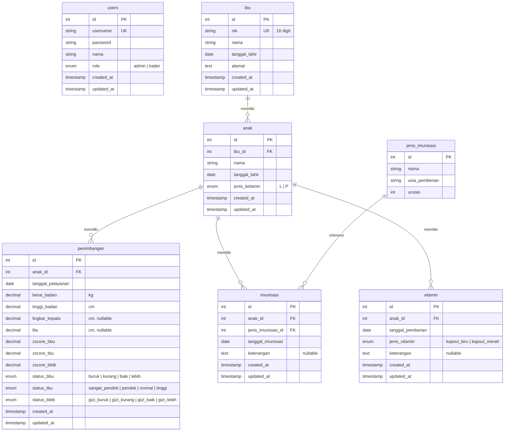

# ERD & Database Spec — Sistem Informasi Posyandu Neiska

## Entity Relationship Diagram

---

## Detail Tabel

### 1. `users` — Data Pengguna

| Kolom | Tipe | Constraint | Keterangan |
| ----- | ---- | ---------- | ---------- |
| id | INTEGER | PK, Auto Increment | |
| username | VARCHAR(50) | UNIQUE, NOT NULL | |
| password | VARCHAR(255) | NOT NULL | Disimpan ter-hash (bcrypt) |
| nama | VARCHAR(100) | NOT NULL | Nama lengkap pengguna |
| role | ENUM | NOT NULL | `admin` atau `kader` |
| created_at | TIMESTAMP | | |
| updated_at | TIMESTAMP | | |

---

### 2. `ibu` — Data Ibu

| Kolom | Tipe | Constraint | Keterangan |
| ----- | ---- | ---------- | ---------- |
| id | INTEGER | PK, Auto Increment | |
| nik | CHAR(16) | UNIQUE, NOT NULL | NIK 16 digit |
| nama | VARCHAR(100) | NOT NULL | |
| tanggal_lahir | DATE | NOT NULL | |
| alamat | TEXT | NOT NULL | |
| created_at | TIMESTAMP | | |
| updated_at | TIMESTAMP | | |

**Aturan hapus:** Tidak bisa dihapus jika masih memiliki anak terdaftar (`RESTRICT`).

---

### 3. `anak` — Data Anak

| Kolom | Tipe | Constraint | Keterangan |
| ----- | ---- | ---------- | ---------- |
| id | INTEGER | PK, Auto Increment | |
| ibu_id | INTEGER | FK → ibu(id), NOT NULL | |
| nama | VARCHAR(100) | NOT NULL | |
| tanggal_lahir | DATE | NOT NULL | |
| jenis_kelamin | ENUM | NOT NULL | `L` (Laki-laki) atau `P` (Perempuan) |
| created_at | TIMESTAMP | | |
| updated_at | TIMESTAMP | | |

**Aturan hapus:** Tidak bisa dihapus jika masih memiliki riwayat penimbangan, imunisasi, atau vitamin (`RESTRICT`).

---

### 4. `penimbangan` — Data Penimbangan & Status Gizi

| Kolom | Tipe | Constraint | Keterangan |
| ----- | ---- | ---------- | ---------- |
| id | INTEGER | PK, Auto Increment | |
| anak_id | INTEGER | FK → anak(id), NOT NULL | |
| tanggal_pelayanan | DATE | NOT NULL | |
| berat_badan | DECIMAL(5,2) | NOT NULL | Dalam kg |
| tinggi_badan | DECIMAL(5,2) | NOT NULL | Dalam cm |
| lingkar_kepala | DECIMAL(5,2) | NULLABLE | Dalam cm |
| lila | DECIMAL(5,2) | NULLABLE | Dalam cm |
| zscore_bbu | DECIMAL(4,2) | NOT NULL | Z-score BB/U, dihitung otomatis |
| zscore_tbu | DECIMAL(4,2) | NOT NULL | Z-score TB/U, dihitung otomatis |
| zscore_bbtb | DECIMAL(4,2) | NOT NULL | Z-score BB/TB, dihitung otomatis |
| status_bbu | ENUM | NOT NULL | `buruk`, `kurang`, `baik`, `lebih` |
| status_tbu | ENUM | NOT NULL | `sangat_pendek`, `pendek`, `normal`, `tinggi` |
| status_bbtb | ENUM | NOT NULL | `gizi_buruk`, `gizi_kurang`, `gizi_baik`, `gizi_lebih` |
| created_at | TIMESTAMP | | |
| updated_at | TIMESTAMP | | |

**Klasifikasi status gizi (standar Kemenkes):**

| Indeks | < -3 SD | -3 SD s/d < -2 SD | -2 SD s/d 2 SD | > 2 SD |
| ------ | ------- | ------------------ | -------------- | ------ |
| BB/U | Gizi Buruk | Gizi Kurang | Gizi Baik | Gizi Lebih |
| TB/U | Sangat Pendek | Pendek | Normal | Tinggi |
| BB/TB | Gizi Buruk | Gizi Kurang | Gizi Baik | Gizi Lebih |

---

### 5. `jenis_imunisasi` — Master Data Imunisasi

| Kolom | Tipe | Constraint | Keterangan |
| ----- | ---- | ---------- | ---------- |
| id | INTEGER | PK, Auto Increment | |
| nama | VARCHAR(50) | NOT NULL | Nama imunisasi |
| usia_pemberian | VARCHAR(30) | NOT NULL | Contoh: "1 bulan", "9 bulan" |
| urutan | INTEGER | NOT NULL | Urutan pemberian |

**Data seed:**

| urutan | nama | usia_pemberian |
| :----: | ---- | -------------- |
| 1 | Hepatitis B-0 | 0–24 jam |
| 2 | BCG | 1 bulan |
| 3 | Polio 1 (OPV) | 1 bulan |
| 4 | DPT-HB-Hib 1 | 2 bulan |
| 5 | Polio 2 (OPV) | 2 bulan |
| 6 | DPT-HB-Hib 2 | 3 bulan |
| 7 | Polio 3 (OPV) | 3 bulan |
| 8 | DPT-HB-Hib 3 | 4 bulan |
| 9 | Polio 4 (OPV) | 4 bulan |
| 10 | IPV | 4 bulan |
| 11 | Campak/MR 1 | 9 bulan |
| 12 | DPT-HB-Hib Lanjutan | 18 bulan |
| 13 | Campak/MR 2 | 18 bulan |

---

### 6. `imunisasi` — Riwayat Imunisasi Anak

| Kolom | Tipe | Constraint | Keterangan |
| ----- | ---- | ---------- | ---------- |
| id | INTEGER | PK, Auto Increment | |
| anak_id | INTEGER | FK → anak(id), NOT NULL | |
| jenis_imunisasi_id | INTEGER | FK → jenis_imunisasi(id), NOT NULL | |
| tanggal_imunisasi | DATE | NOT NULL | |
| keterangan | TEXT | NULLABLE | |
| created_at | TIMESTAMP | | |
| updated_at | TIMESTAMP | | |

**Constraint:** UNIQUE pada kombinasi `(anak_id, jenis_imunisasi_id)` — satu anak tidak bisa mendapat imunisasi yang sama dua kali.

---

### 7. `vitamin` — Riwayat Pemberian Vitamin

| Kolom | Tipe | Constraint | Keterangan |
| ----- | ---- | ---------- | ---------- |
| id | INTEGER | PK, Auto Increment | |
| anak_id | INTEGER | FK → anak(id), NOT NULL | |
| tanggal_pemberian | DATE | NOT NULL | |
| jenis_vitamin | ENUM | NOT NULL | `kapsul_biru` (usia 6–11 bln) atau `kapsul_merah` (usia 12–59 bln) |
| keterangan | TEXT | NULLABLE | |
| created_at | TIMESTAMP | | |
| updated_at | TIMESTAMP | | |

---

## Ringkasan Relasi

| Relasi | Tipe | Constraint Hapus |
| ------ | ---- | ---------------- |
| ibu → anak | One-to-Many | RESTRICT (ibu tidak bisa dihapus jika punya anak) |
| anak → penimbangan | One-to-Many | RESTRICT (anak tidak bisa dihapus jika punya riwayat) |
| anak → imunisasi | One-to-Many | RESTRICT |
| anak → vitamin | One-to-Many | RESTRICT |
| jenis_imunisasi → imunisasi | One-to-Many | RESTRICT |
