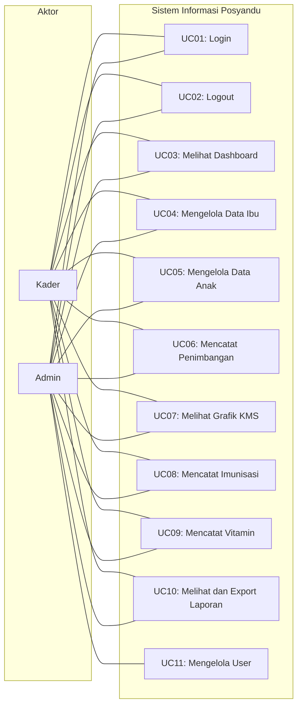
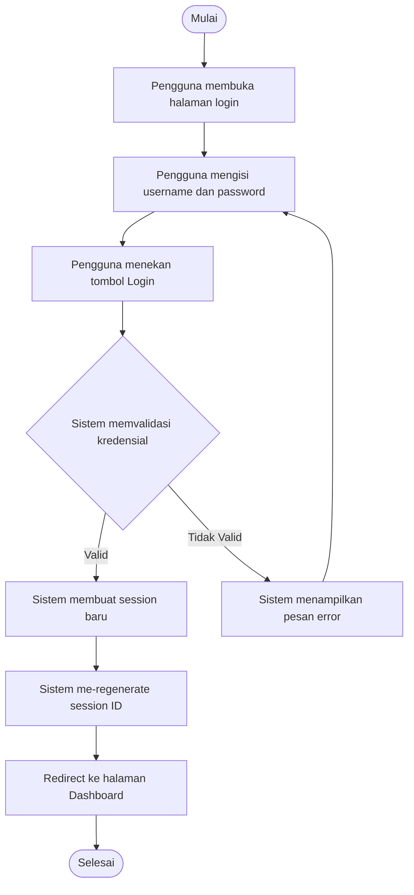
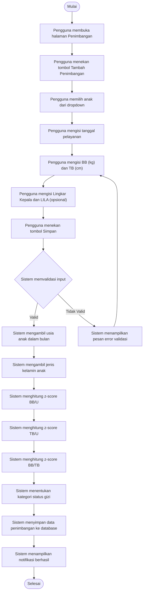
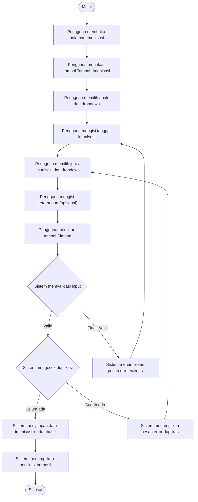
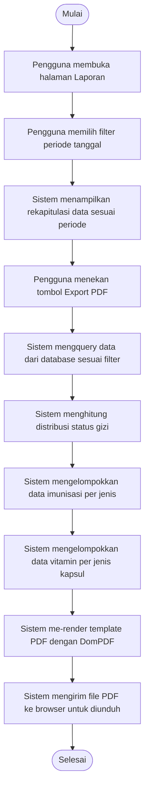
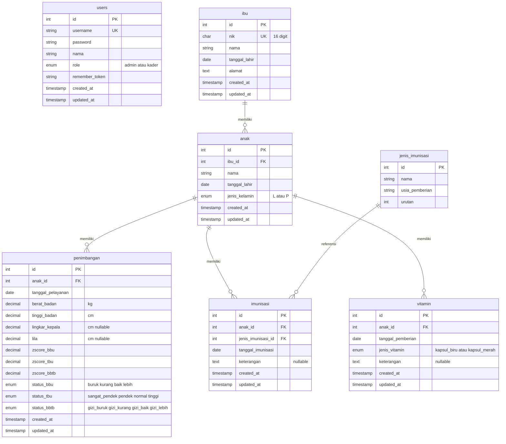

# DOKUMEN TUGAS AKHIR
# SISTEM INFORMASI POSYANDU [NAMA POSYANDU]

> **Catatan:** Bagian yang ditandai `[...]` perlu diisi/disesuaikan oleh penulis.
> Dokumen ini mencakup **BAB I – BAB III**. BAB IV–VI akan di-generate terpisah.

---

# BAB I — PENDAHULUAN

## 1.1 Latar Belakang

Posyandu (Pos Pelayanan Terpadu) merupakan salah satu bentuk Upaya Kesehatan Bersumberdaya Masyarakat (UKBM) yang dikelola dan diselenggarakan dari, oleh, untuk, dan bersama masyarakat dalam penyelenggaraan pembangunan kesehatan. Posyandu berperan penting dalam pemantauan tumbuh kembang balita melalui kegiatan penimbangan berat badan, pengukuran tinggi badan, pemberian imunisasi, dan pemberian vitamin A (Kemenkes RI, 2011).

Pada praktiknya, sebagian besar posyandu di Indonesia masih mengandalkan pencatatan secara manual menggunakan buku register dan Kartu Menuju Sehat (KMS) fisik. Proses pencatatan manual ini memiliki sejumlah kelemahan, antara lain:

1. **Rentan kesalahan pencatatan** — Data berat badan, tinggi badan, dan hasil penimbangan dicatat dengan tulisan tangan yang terkadang sulit dibaca atau terjadi kesalahan penulisan angka.
2. **Sulit melakukan rekapitulasi** — Pembuatan laporan bulanan memerlukan penghitungan ulang secara manual dari buku register, yang memakan waktu dan tenaga kader.
3. **Penentuan status gizi tidak konsisten** — Perhitungan z-score untuk menentukan status gizi balita (Gizi Buruk, Gizi Kurang, Gizi Baik, Gizi Lebih) harus dilakukan secara manual dengan merujuk pada tabel standar Kementerian Kesehatan, sehingga rentan terjadi kesalahan interpretasi.
4. **Kehilangan data** — Buku register fisik dapat rusak, hilang, atau terbakar, sehingga riwayat data balita tidak dapat dipulihkan.
5. **Pemantauan pertumbuhan sulit dilacak** — Tanpa grafik KMS digital, kader kesulitan melihat tren pertumbuhan anak secara visual dari waktu ke waktu.

Posyandu [Nama Posyandu] yang berlokasi di [Alamat] merupakan salah satu posyandu yang masih menggunakan sistem pencatatan manual. Posyandu ini melayani pemantauan tumbuh kembang balita yang mencakup penimbangan, pemberian imunisasi sesuai program nasional, dan pemberian vitamin A. Berdasarkan observasi dan wawancara dengan kader posyandu, ditemukan permasalahan yang sama seperti yang telah disebutkan di atas.

Berdasarkan permasalahan tersebut, maka diperlukan sebuah sistem informasi berbasis web yang dapat mendigitalkan proses pencatatan dan pelaporan kegiatan posyandu. Sistem ini diharapkan dapat mengelola data ibu dan anak, mencatat hasil penimbangan, menghitung status gizi secara otomatis berdasarkan standar Kementerian Kesehatan, mencatat riwayat imunisasi dan pemberian vitamin A, serta menghasilkan laporan dalam format yang siap cetak.

Dengan latar belakang tersebut, penulis mengambil judul tugas akhir **"[Judul Tugas Akhir]"**.

## 1.2 Rumusan Masalah

Berdasarkan latar belakang di atas, rumusan masalah dalam penelitian ini adalah:

1. Bagaimana merancang dan membangun sistem informasi posyandu berbasis web dengan form pelayanan terpadu satu pintu yang mengintegrasikan pendaftaran, penimbangan, imunisasi, vitamin, dan rekapitulasi harian secara ringkas?
2. Bagaimana menerapkan pembagian hak akses (*Role-Based Access Control*) yang memisahkan secara tegas tugas operasional lapangan bagi Kader dan fungsi manajerial pengawasan bagi Admin?
3. Bagaimana mengimplementasikan kalkulasi status gizi balita secara otomatis berdasarkan standar z-score Kementerian Kesehatan serta grafik KMS digital?
4. Bagaimana merancang modul kesehatan ibu hamil yang mencakup pencatatan pemeriksaan Antenatal Care (ANC) dan grafik kenaikan berat badan ibu hamil berdasarkan standar Buku KIA (Buku Pink) Kementerian Kesehatan RI?
5. Bagaimana menghasilkan laporan rekapitulasi kegiatan posyandu dalam format PDF yang siap cetak?

## 1.3 Batasan Masalah

Agar penelitian ini lebih terarah, maka ditetapkan batasan masalah sebagai berikut:

1. Sistem yang dibangun mencakup **satu posyandu** saja, bukan sistem multi-posyandu.
2. Cakupan pelayanan yang dikelola dalam sistem mencakup pelayanan **anak (balita)** (tumbuh kembang, imunisasi, vitamin A) dan pelayanan **kesehatan ibu hamil** (pemeriksaan Antenatal Care / Buku KIA), tidak termasuk pelayanan lansia atau program KB.
3. Pengguna sistem terdiri dari dua role dengan hak akses berbeda (**Role-Based Access Control / RBAC**):
   - **Kader**: Memiliki akses ke antarmuka operasional lapangan melalui Form Pelayanan Terpadu, pembaruan data warga binaan, pencatatan ANC ibu hamil, dan rekap harian; serta dibatasi agar tidak dapat menghapus data master maupun mengubah konfigurasi sistem/pengguna.
   - **Admin**: Memiliki akses penuh (*full control*) meliputi dashboard analitik, master data, hak audit & hapus data, laporan posyandu, dan manajemen pengguna (*User Management*).
4. Standar kurva dan pemantauan kesehatan mengacu pada **standar Kementerian Kesehatan RI**:
   - Status gizi balita berdasarkan tabel z-score WHO/Kemenkes 2020 (indeks BB/U, TB/U, dan BB/TB).
   - Grafik peningkatan berat badan ibu hamil berdasarkan rentang indeks massa tubuh (IMT) pra-hamil standar Buku KIA Kemenkes RI.
5. Sistem dibangun berbasis web menggunakan framework **Laravel** dengan **Livewire** sebagai komponen antarmuka reaktif.
6. Basis data yang digunakan adalah **SQLite**.
7. Metode pengembangan yang digunakan adalah **Waterfall**.
8. Metode pengujian yang digunakan adalah **White Box Testing**.

## 1.4 Tujuan Penelitian

Tujuan dari penelitian ini adalah:

1. Merancang dan membangun sistem informasi posyandu berbasis web dengan alur kerja pelayanan terpadu satu pintu (*one-stop service*) untuk meningkatkan efisiensi pencatatan kader posyandu.
2. Mengimplementasikan sistem autentikasi dan otorisasi berbasis peran (*Role-Based Access Control*) yang memisahkan antarmuka kerja dan hak akses antara Kader dan Admin secara aman.
3. Mengimplementasikan fitur kalkulasi status gizi otomatis menggunakan z-score berdasarkan standar Kementerian Kesehatan (BB/U, TB/U, dan BB/TB) serta visualisasi grafik KMS digital interaktif.
4. Membangun modul kesehatan ibu hamil sesuai standar Buku KIA Kementerian Kesehatan RI yang dilengkapi visualisasi grafik peningkatan berat badan ibu hamil selama masa gestasi.
5. Menyediakan fitur rekapitulasi dan cetak laporan kegiatan posyandu dalam format PDF.

## 1.5 Manfaat Penelitian

### 1.5.1 Manfaat Praktis

1. **Bagi Kader Posyandu** — Mempermudah pencatatan data balita, penimbangan, imunisasi, dan vitamin tanpa harus menulis secara manual di buku register. Kalkulasi status gizi otomatis menghemat waktu dan mengurangi kesalahan.
2. **Bagi Posyandu** — Meningkatkan akurasi data, mempercepat pembuatan laporan, dan menyediakan visualisasi tren pertumbuhan anak yang membantu pengambilan keputusan.
3. **Bagi Ibu Balita** — Data pertumbuhan anak terdokumentasi secara digital dan dapat diakses kapan saja, sehingga memudahkan pemantauan status gizi anak.

### 1.5.2 Manfaat Akademis

1. Menerapkan ilmu yang diperoleh selama perkuliahan, khususnya dalam pengembangan sistem informasi berbasis web.
2. Sebagai referensi bagi penelitian selanjutnya yang berkaitan dengan sistem informasi posyandu.

## 1.6 Sistematika Penulisan

Sistematika penulisan tugas akhir ini terdiri dari enam bab, sebagai berikut:

**BAB I PENDAHULUAN**
Bab ini berisi latar belakang masalah, rumusan masalah, batasan masalah, tujuan penelitian, manfaat penelitian, dan sistematika penulisan.

**BAB II LANDASAN TEORI**
Bab ini berisi teori-teori yang mendasari penelitian, meliputi posyandu, status gizi balita, Kartu Menuju Sehat (KMS), program imunisasi nasional, vitamin A, sistem informasi, metode pengembangan Waterfall, metode pengujian White Box Testing, serta teknologi yang digunakan.

**BAB III METODOLOGI PENELITIAN**
Bab ini menjelaskan metode pengembangan sistem (Waterfall), metode pengujian (White Box Testing), serta alat dan bahan yang digunakan dalam pengembangan.

**BAB IV PERANCANGAN SISTEM**
Bab ini berisi analisis kebutuhan fungsional dan non-fungsional, perancangan sistem menggunakan Use Case Diagram dan Activity Diagram, perancangan basis data menggunakan Entity Relationship Diagram (ERD), serta perancangan antarmuka pengguna.

**BAB V IMPLEMENTASI DAN PENGUJIAN**
Bab ini berisi implementasi sistem berdasarkan perancangan yang telah dibuat, beserta hasil pengujian menggunakan metode White Box Testing.

**BAB VI PENUTUP**
Bab ini berisi kesimpulan dari hasil penelitian dan saran untuk pengembangan sistem di masa depan.

---

# BAB II — LANDASAN TEORI

## 2.1 Posyandu

### 2.1.1 Pengertian Posyandu

Posyandu (Pos Pelayanan Terpadu) adalah salah satu bentuk Upaya Kesehatan Bersumberdaya Masyarakat (UKBM) yang dikelola dan diselenggarakan dari, oleh, untuk, dan bersama masyarakat dalam penyelenggaraan pembangunan kesehatan, guna memberdayakan masyarakat dan memberikan kemudahan kepada masyarakat dalam memperoleh pelayanan kesehatan dasar untuk mempercepat penurunan angka kematian ibu dan bayi (Kemenkes RI, 2011).

### 2.1.2 Kegiatan Posyandu

Kegiatan utama posyandu dalam pelayanan kesehatan balita meliputi:

1. **Penimbangan berat badan** — Dilakukan setiap bulan untuk memantau pertumbuhan balita.
2. **Pengukuran tinggi badan** — Dilakukan untuk mengetahui perkembangan tinggi badan balita sesuai usia.
3. **Pemberian imunisasi** — Sesuai dengan program imunisasi nasional yang ditetapkan oleh Kementerian Kesehatan.
4. **Pemberian vitamin A** — Diberikan dua kali setahun pada bulan Februari dan Agustus.
5. **Penyuluhan kesehatan** — Memberikan edukasi kepada ibu mengenai gizi, kebersihan, dan pola asuh anak.

### 2.1.3 Peran Kader Posyandu

Kader posyandu adalah anggota masyarakat yang dipilih dan ditunjuk untuk menjalankan kegiatan posyandu secara sukarela. Tugas kader meliputi pendaftaran peserta, penimbangan balita, pencatatan hasil penimbangan di buku register dan KMS, serta melaporkan hasil kegiatan kepada puskesmas.

## 2.2 Status Gizi Balita

### 2.2.1 Pengertian Status Gizi

Status gizi adalah keadaan tubuh sebagai akibat dari konsumsi makanan dan penggunaan zat-zat gizi (Almatsier, 2009). Penilaian status gizi balita dilakukan dengan membandingkan data antropometri anak (berat badan, tinggi badan) dengan standar yang telah ditetapkan.

### 2.2.2 Indeks Antropometri

Berdasarkan Peraturan Menteri Kesehatan Republik Indonesia Nomor 2 Tahun 2020 tentang Standar Antropometri Anak, penilaian status gizi balita menggunakan tiga indeks utama:

| Indeks | Singkatan | Pengukuran |
|--------|-----------|------------|
| Berat Badan menurut Umur | BB/U | Membandingkan berat badan anak dengan berat badan standar pada usia yang sama |
| Tinggi Badan menurut Umur | TB/U | Membandingkan tinggi badan anak dengan tinggi badan standar pada usia yang sama |
| Berat Badan menurut Tinggi Badan | BB/TB | Membandingkan berat badan anak dengan berat badan standar pada tinggi badan yang sama |

### 2.2.3 Z-Score

Z-score adalah nilai yang menunjukkan seberapa jauh suatu hasil pengukuran menyimpang dari nilai median (nilai tengah) populasi standar. Z-score dihitung menggunakan rumus:

```
Z = (Nilai Terukur - Median) / Standar Deviasi (SD)
```

Di mana:
- **Nilai Terukur** = berat badan atau tinggi badan anak yang diukur
- **Median** = nilai tengah dari standar referensi (berdasarkan WHO 2006)
- **SD** = standar deviasi dari standar referensi

### 2.2.4 Klasifikasi Status Gizi

Berdasarkan standar Kementerian Kesehatan, klasifikasi status gizi balita adalah sebagai berikut:

**Tabel 2.1** Klasifikasi Status Gizi berdasarkan Indeks BB/U

| Kategori | Ambang Batas (Z-Score) |
|----------|----------------------|
| Gizi Buruk | < -3 SD |
| Gizi Kurang | -3 SD sampai < -2 SD |
| Gizi Baik | -2 SD sampai 2 SD |
| Gizi Lebih | > 2 SD |

**Tabel 2.2** Klasifikasi Status Gizi berdasarkan Indeks TB/U

| Kategori | Ambang Batas (Z-Score) |
|----------|----------------------|
| Sangat Pendek | < -3 SD |
| Pendek | -3 SD sampai < -2 SD |
| Normal | -2 SD sampai 2 SD |
| Tinggi | > 2 SD |

**Tabel 2.3** Klasifikasi Status Gizi berdasarkan Indeks BB/TB

| Kategori | Ambang Batas (Z-Score) |
|----------|----------------------|
| Gizi Buruk | < -3 SD |
| Gizi Kurang | -3 SD sampai < -2 SD |
| Gizi Baik | -2 SD sampai 2 SD |
| Gizi Lebih | > 2 SD |

## 2.3 Kartu Menuju Sehat (KMS)

### 2.3.1 Pengertian KMS

Kartu Menuju Sehat (KMS) adalah kartu yang memuat kurva pertumbuhan normal anak berdasarkan indeks antropometri berat badan menurut umur (BB/U). KMS digunakan sebagai alat untuk memantau pertumbuhan anak secara berkala melalui penimbangan setiap bulan di posyandu (Kemenkes RI, 2010).

### 2.3.2 Interpretasi Grafik KMS

Grafik KMS menampilkan kurva pertumbuhan dengan zona warna yang merepresentasikan status gizi:

| Zona Warna | Status | Keterangan |
|------------|--------|------------|
| Zona merah (di bawah garis merah) | Gizi Buruk | Berat badan sangat kurang dari standar (< -3 SD) |
| Zona kuning (antara garis merah dan kuning) | Gizi Kurang | Berat badan kurang dari standar (-3 SD s/d < -2 SD) |
| Zona hijau (area standar) | Gizi Baik | Berat badan sesuai standar (-2 SD s/d 2 SD) |
| Zona biru (di atas garis atas) | Gizi Lebih | Berat badan melebihi standar (> 2 SD) |

Dalam implementasi digital, grafik KMS dapat divisualisasikan secara interaktif menggunakan pustaka *charting* seperti Chart.js atau ApexCharts, di mana data penimbangan anak diplot pada kurva standar, sehingga kader dan orang tua dapat dengan mudah melihat tren pertumbuhan anak.

## 2.4 Program Imunisasi Nasional

### 2.4.1 Pengertian Imunisasi

Imunisasi adalah suatu upaya untuk meningkatkan kekebalan tubuh seseorang secara aktif terhadap suatu penyakit, sehingga apabila suatu saat terpapar dengan penyakit tersebut, orang tersebut tidak akan sakit atau hanya mengalami sakit ringan (Permenkes No. 12 Tahun 2017).

### 2.4.2 Jadwal Imunisasi Dasar

Berdasarkan program imunisasi nasional, jadwal imunisasi dasar untuk anak usia 0–18 bulan adalah sebagai berikut:

**Tabel 2.4** Jadwal Imunisasi Dasar Nasional

| No | Jenis Imunisasi | Usia Pemberian |
|----|----------------|---------------|
| 1 | Hepatitis B-0 | 0–24 jam setelah lahir |
| 2 | BCG | 1 bulan |
| 3 | Polio 1 (OPV) | 1 bulan |
| 4 | DPT-HB-Hib 1 | 2 bulan |
| 5 | Polio 2 (OPV) | 2 bulan |
| 6 | DPT-HB-Hib 2 | 3 bulan |
| 7 | Polio 3 (OPV) | 3 bulan |
| 8 | DPT-HB-Hib 3 | 4 bulan |
| 9 | Polio 4 (OPV) | 4 bulan |
| 10 | IPV | 4 bulan |
| 11 | Campak/MR 1 | 9 bulan |
| 12 | DPT-HB-Hib Lanjutan | 18 bulan |
| 13 | Campak/MR 2 | 18 bulan |

### 2.4.3 Prinsip Pencatatan Imunisasi

Setiap pemberian imunisasi dicatat pada kartu imunisasi anak. Satu jenis imunisasi hanya diberikan satu kali untuk setiap anak (kecuali yang memiliki dosis lanjutan). Dalam sistem digital, pencatatan imunisasi harus memiliki **validasi duplikasi** untuk memastikan satu jenis imunisasi tidak dicatat dua kali pada anak yang sama.

## 2.5 Vitamin A

### 2.5.1 Pengertian dan Manfaat

Vitamin A merupakan salah satu zat gizi mikro yang penting untuk kesehatan mata, pertumbuhan, dan daya tahan tubuh anak. Pemberian vitamin A pada balita merupakan program nasional yang dilaksanakan dua kali setahun, yaitu pada bulan **Februari** dan **Agustus** (Kemenkes RI, 2018).

### 2.5.2 Jenis Kapsul Vitamin A

Terdapat dua jenis kapsul vitamin A yang diberikan berdasarkan kelompok usia:

**Tabel 2.5** Jenis Kapsul Vitamin A

| Jenis Kapsul | Warna | Dosis | Kelompok Usia |
|-------------|-------|-------|--------------|
| Kapsul Biru | Biru | 100.000 IU | Bayi usia 6–11 bulan |
| Kapsul Merah | Merah | 200.000 IU | Anak usia 12–59 bulan |

Dalam sistem informasi posyandu, validasi kesesuaian jenis kapsul terhadap usia anak harus dilakukan secara otomatis untuk mencegah kesalahan pemberian.

## 2.6 Sistem Informasi

### 2.6.1 Pengertian Sistem Informasi

Sistem informasi adalah suatu sistem di dalam suatu organisasi yang mempertemukan kebutuhan pengolahan transaksi harian, mendukung operasi, bersifat manajerial, dan kegiatan strategi dari suatu organisasi, serta menyediakan pihak luar tertentu dengan laporan-laporan yang diperlukan (Jogiyanto, 2005).

### 2.6.2 Komponen Sistem Informasi

Menurut O'Brien dan Marakas (2011), komponen sistem informasi terdiri dari:

1. **Sumber daya manusia** (*People*) — Pengguna akhir dan spesialis sistem informasi.
2. **Perangkat keras** (*Hardware*) — Komputer, perangkat jaringan, dan media penyimpanan.
3. **Perangkat lunak** (*Software*) — Program aplikasi dan sistem operasi.
4. **Data** (*Data*) — Fakta dan informasi yang disimpan dalam basis data.
5. **Jaringan** (*Network*) — Media komunikasi dan infrastruktur jaringan.
6. **Prosedur** (*Procedures*) — Kebijakan dan aturan penggunaan sistem.

### 2.6.3 Sistem Informasi Berbasis Web

Sistem informasi berbasis web (*web-based information system*) adalah sistem informasi yang diakses melalui *browser* menggunakan protokol HTTP/HTTPS. Keunggulan sistem berbasis web meliputi aksesibilitas dari berbagai perangkat, tidak memerlukan instalasi aplikasi khusus, dan kemudahan dalam pemeliharaan serta pembaruan sistem.

## 2.7 Metode Pengembangan Waterfall

### 2.7.1 Pengertian Waterfall

Metode Waterfall adalah model pengembangan perangkat lunak yang bersifat sekuensial (berurutan), di mana setiap fase harus diselesaikan sepenuhnya sebelum melanjutkan ke fase berikutnya. Model ini pertama kali diperkenalkan oleh Winston W. Royce pada tahun 1970 (Pressman, 2014).

### 2.7.2 Tahapan Waterfall

Model Waterfall terdiri dari lima tahapan utama:

```
┌───────────────────┐
│  1. Requirements  │ → Pengumpulan dan analisis kebutuhan
│     Analysis      │
└────────┬──────────┘
         ▼
┌───────────────────┐
│  2. System        │ → Perancangan sistem dan basis data
│     Design        │
└────────┬──────────┘
         ▼
┌───────────────────┐
│  3. Implementation│ → Penulisan kode program (coding)
│     (Coding)      │
└────────┬──────────┘
         ▼
┌───────────────────┐
│  4. Testing       │ → Pengujian sistem
│                   │
└────────┬──────────┘
         ▼
┌───────────────────┐
│  5. Deployment &  │ → Penerapan dan pemeliharaan
│     Maintenance   │
└───────────────────┘
```

**1. Requirements Analysis (Analisis Kebutuhan)**
Tahap ini meliputi pengumpulan data melalui wawancara dengan kader dan admin posyandu, observasi proses pencatatan manual yang sedang berjalan, serta studi literatur. Hasil dari tahap ini adalah dokumen kebutuhan fungsional dan non-fungsional sistem.

**2. System Design (Perancangan Sistem)**
Pada tahap ini dilakukan perancangan sistem yang meliputi pembuatan Use Case Diagram, Activity Diagram, Entity Relationship Diagram (ERD), perancangan struktur basis data, dan perancangan antarmuka pengguna (*user interface design*).

**3. Implementation / Coding (Implementasi)**
Tahap ini merupakan proses penulisan kode program berdasarkan perancangan yang telah dibuat. Sistem dibangun menggunakan framework Laravel 13 dengan Livewire 4 sebagai komponen interaktif, serta SQLite sebagai basis data.

**4. Testing (Pengujian)**
Pengujian dilakukan menggunakan metode White Box Testing untuk memastikan setiap logika dan alur program berjalan sesuai yang diharapkan.

**5. Deployment & Maintenance (Penerapan dan Pemeliharaan)**
Sistem yang telah lolos pengujian diterapkan pada lingkungan produksi dan diserahkan kepada pengguna. Pemeliharaan meliputi perbaikan *bug*, pembaruan fitur, dan pemantauan performa sistem.

### 2.7.3 Kelebihan dan Kekurangan Waterfall

**Tabel 2.6** Kelebihan dan Kekurangan Metode Waterfall

| Kelebihan | Kekurangan |
|-----------|------------|
| Mudah dipahami dan dikelola karena struktur yang jelas dan berurutan | Tidak fleksibel terhadap perubahan kebutuhan di tengah proses |
| Dokumentasi lengkap di setiap tahap | Pengguna baru melihat hasil akhir setelah seluruh tahap selesai |
| Cocok untuk proyek dengan kebutuhan yang sudah jelas dan stabil | Jika ditemukan kesalahan di tahap akhir, biaya perbaikan menjadi besar |
| Progres mudah diukur karena tahapan yang terstruktur | Proses pengembangan memakan waktu relatif lama |

## 2.8 White Box Testing

### 2.8.1 Pengertian White Box Testing

White Box Testing (atau disebut juga *Glass Box Testing*, *Clear Box Testing*, atau *Structural Testing*) adalah metode pengujian perangkat lunak yang menguji **struktur internal dan logika kode program**. Penguji memiliki akses penuh terhadap *source code* dan menguji alur eksekusi program, percabangan kondisi, dan logika perhitungan (Pressman, 2014).

### 2.8.2 Tujuan White Box Testing

Tujuan dari White Box Testing adalah:

1. Memastikan semua jalur eksekusi (*path*) dalam kode telah diuji minimal satu kali.
2. Memverifikasi bahwa setiap percabangan kondisi (`if`, `else`, `switch`) menghasilkan output yang benar.
3. Memastikan logika perhitungan (seperti kalkulasi z-score) menghasilkan nilai yang akurat.
4. Mendeteksi kesalahan logika, *dead code*, dan *infinite loop*.

### 2.8.3 Teknik White Box Testing

Teknik-teknik yang digunakan dalam White Box Testing meliputi:

**Tabel 2.7** Teknik White Box Testing

| Teknik | Penjelasan |
|--------|------------|
| *Statement Coverage* | Memastikan setiap baris kode (pernyataan) dieksekusi minimal satu kali selama pengujian |
| *Branch Coverage* | Memastikan setiap cabang keputusan (percabangan `if/else`) diuji pada kedua kondisi (benar dan salah) |
| *Path Coverage* | Memastikan setiap jalur eksekusi yang mungkin dalam kode diuji |
| *Condition Coverage* | Memastikan setiap kondisi dalam ekspresi logika dievaluasi pada kedua nilai (true dan false) |

### 2.8.4 Perbedaan White Box dan Black Box Testing

**Tabel 2.8** Perbandingan White Box Testing dan Black Box Testing

| Aspek | White Box Testing | Black Box Testing |
|-------|-------------------|-------------------|
| Pengetahuan kode | Penguji mengetahui struktur internal kode | Penguji tidak mengetahui isi kode |
| Fokus pengujian | Logika internal, alur eksekusi, perhitungan | Fungsionalitas dari perspektif pengguna |
| Basis pengujian | Source code program | Spesifikasi kebutuhan |
| Dilakukan oleh | Developer / programmer | Tester / pengguna |
| Contoh | Menguji apakah rumus z-score menghasilkan nilai yang benar | Menguji apakah status gizi ditampilkan dengan benar di layar |

## 2.9 Teknologi yang Digunakan

### 2.9.1 PHP

PHP (*Hypertext Preprocessor*) adalah bahasa pemrograman *server-side* yang banyak digunakan untuk pengembangan aplikasi web. PHP bersifat *open-source*, memiliki komunitas yang besar, dan didukung oleh berbagai *framework* modern. Versi yang digunakan dalam penelitian ini adalah **PHP 8.3**.

### 2.9.2 Laravel

Laravel adalah *framework* PHP yang mengikuti arsitektur MVC (*Model-View-Controller*) dan menyediakan fitur-fitur bawaan seperti *routing*, *middleware*, *Eloquent ORM*, *migration*, *authentication*, dan *templating engine* (Blade). Laravel dikenal dengan sintaksis yang ekspresif dan elegan, serta dokumentasi yang komprehensif (Laravel Documentation, 2025). Versi yang digunakan dalam penelitian ini adalah **Laravel 13.x**.

### 2.9.3 Livewire

Livewire adalah *framework full-stack* untuk Laravel yang memungkinkan pembuatan komponen antarmuka interaktif tanpa menulis JavaScript secara langsung. Livewire bekerja dengan cara mengirimkan *request* AJAX ke server untuk memperbarui tampilan secara dinamis, sehingga pengembang dapat membangun antarmuka yang responsif dan interaktif menggunakan PHP murni (Livewire Documentation, 2025). Versi yang digunakan adalah **Livewire 4.x**.

### 2.9.4 SQLite

SQLite adalah sistem manajemen basis data relasional (*RDBMS*) yang bersifat *serverless* dan *self-contained*. Berbeda dengan MySQL atau PostgreSQL yang memerlukan server terpisah, SQLite menyimpan seluruh basis data dalam satu file tunggal (`.sqlite`). SQLite cocok digunakan untuk aplikasi berskala kecil hingga menengah dan tidak memerlukan konfigurasi server yang rumit (SQLite Documentation, 2025). Versi yang digunakan adalah **SQLite 3.x**.

### 2.9.5 Tailwind CSS

Tailwind CSS adalah *framework* CSS yang menggunakan pendekatan *utility-first*, di mana pengembang membangun tampilan dengan menggabungkan kelas-kelas utilitas secara langsung di elemen HTML, tanpa perlu menulis CSS kustom secara terpisah. Tailwind CSS memungkinkan pengembangan antarmuka yang cepat dan konsisten (Tailwind CSS Documentation, 2025). Versi yang digunakan adalah **Tailwind CSS 4.x**.

### 2.9.6 Chart.js / ApexCharts

Chart.js dan ApexCharts adalah pustaka JavaScript *open-source* untuk membuat grafik dan visualisasi data yang interaktif pada halaman web. Dalam penelitian ini, pustaka *charting* digunakan untuk menampilkan grafik KMS (Kartu Menuju Sehat) yang memvisualisasikan kurva pertumbuhan anak beserta zona warna status gizi.

### 2.9.7 DomPDF

DomPDF adalah pustaka PHP yang berfungsi untuk mengkonversi dokumen HTML/CSS menjadi file PDF. Dalam konteks Laravel, DomPDF digunakan melalui paket `barryvdh/laravel-dompdf` yang menyediakan integrasi langsung dengan framework Laravel. Pustaka ini digunakan untuk menghasilkan laporan kegiatan posyandu dalam format PDF yang siap cetak.

### 2.9.8 Vite

Vite adalah *build tool* modern untuk proyek web yang menyediakan *Hot Module Replacement* (HMR) untuk pengembangan yang cepat dan proses *build* yang optimal untuk produksi. Dalam proyek Laravel, Vite digunakan sebagai pengganti Laravel Mix untuk mengelola dan mengompilasi aset *frontend* seperti CSS dan JavaScript.

### 2.9.9 Entity Relationship Diagram (ERD)

Entity Relationship Diagram (ERD) adalah notasi grafis yang digunakan untuk memodelkan data pada level konseptual dalam perancangan basis data. ERD menggambarkan hubungan antar entitas dalam suatu sistem, termasuk atribut-atribut setiap entitas dan jenis relasi antar entitas (one-to-one, one-to-many, many-to-many) (Connolly & Begg, 2015).

### 2.9.10 Use Case Diagram

Use Case Diagram adalah salah satu diagram dalam UML (*Unified Modeling Language*) yang menggambarkan interaksi antara aktor (pengguna) dengan sistem. Use Case Diagram menunjukkan fungsionalitas apa saja yang disediakan oleh sistem dan siapa yang dapat mengakses masing-masing fungsi tersebut (Booch et al., 2005).

---

# BAB III — METODOLOGI PENELITIAN

## 3.1 Metode Pengembangan Sistem

Metode pengembangan yang digunakan dalam penelitian ini adalah **Waterfall**. Pemilihan metode ini didasarkan pada beberapa pertimbangan:

1. Kebutuhan sistem telah terdefinisi dengan jelas sejak awal melalui wawancara dengan kader dan admin posyandu.
2. Ruang lingkup proyek relatif terbatas (satu posyandu, pelayanan balita saja), sehingga perubahan kebutuhan di tengah proses kecil kemungkinannya.
3. Dokumentasi setiap tahap pengembangan diperlukan untuk keperluan tugas akhir.

Berikut adalah penerapan setiap tahap Waterfall dalam penelitian ini:

### 3.1.1 Tahap 1: Analisis Kebutuhan (*Requirements Analysis*)

Pada tahap ini dilakukan pengumpulan data dan informasi mengenai proses bisnis yang berjalan di posyandu. Teknik yang digunakan meliputi:

**a. Wawancara**
Wawancara dilakukan dengan kader dan admin Posyandu [Nama Posyandu] untuk mengetahui:
- Proses pencatatan data ibu dan anak yang sedang berjalan
- Prosedur penimbangan dan penentuan status gizi
- Pencatatan riwayat imunisasi dan pemberian vitamin A
- Proses pembuatan laporan bulanan
- Kendala-kendala yang dihadapi dalam proses pencatatan manual

**b. Observasi**
Observasi dilakukan secara langsung di lokasi posyandu untuk mengamati:
- Alur kegiatan posyandu dari pendaftaran hingga pencatatan
- Format buku register dan KMS yang digunakan
- Interaksi antara kader dengan ibu balita

**c. Studi Literatur**
Studi literatur dilakukan untuk mempelajari:
- Standar z-score Kementerian Kesehatan / WHO 2006
- Program imunisasi nasional
- Panduan pemberian vitamin A
- Teknologi pengembangan web (Laravel, Livewire, SQLite)

**Hasil:**
Berdasarkan pengumpulan data di atas, diperoleh daftar kebutuhan fungsional dan non-fungsional yang akan menjadi dasar perancangan sistem. Detail kebutuhan dijelaskan pada BAB IV.

### 3.1.2 Tahap 2: Perancangan Sistem (*System Design*)

Pada tahap ini dilakukan perancangan sistem berdasarkan hasil analisis kebutuhan. Perancangan yang dilakukan meliputi:

| Perancangan | Output | Keterangan |
|-------------|--------|------------|
| Perancangan proses | Use Case Diagram, Activity Diagram | Menggambarkan alur interaksi pengguna dengan sistem |
| Perancangan basis data | Entity Relationship Diagram (ERD) | Menggambarkan struktur tabel dan relasi antar entitas |
| Perancangan antarmuka | Mockup / wireframe | Menggambarkan tampilan halaman-halaman utama sistem |

Detail perancangan dijelaskan pada BAB IV.

### 3.1.3 Tahap 3: Implementasi / Coding

Pada tahap ini, perancangan yang telah dibuat diterjemahkan menjadi kode program. Implementasi dilakukan menggunakan teknologi sebagai berikut:

| Komponen | Teknologi | Versi |
|----------|-----------|-------|
| Bahasa pemrograman | PHP | ≥ 8.3 |
| Framework backend | Laravel | 13.x |
| Framework frontend | Livewire + Blade | 4.x |
| Basis data | SQLite | 3.x |
| CSS framework | Tailwind CSS | 4.x |
| Grafik/chart | Chart.js / ApexCharts | - |
| Export PDF | DomPDF (barryvdh/laravel-dompdf) | 3.x |
| Build tool | Vite | 8.x |

Arsitektur aplikasi mengikuti pola **Livewire Component Pattern**, di mana setiap modul terdiri dari komponen `Index` (untuk menampilkan daftar data) dan komponen `Form` (untuk tambah dan edit data). Logika bisnis yang kompleks, seperti kalkulasi z-score dan penentuan status gizi, dipisahkan ke dalam *Service Layer* (`StatusGiziService`).

### 3.1.4 Tahap 4: Pengujian (*Testing*)

Pengujian dilakukan menggunakan metode **White Box Testing** pada setiap modul sistem. Detail metode pengujian dijelaskan pada sub-bab 3.2.

### 3.1.5 Tahap 5: Penerapan dan Pemeliharaan (*Deployment & Maintenance*)

Setelah sistem lolos pengujian, dilakukan penerapan (*deployment*) sistem pada lingkungan produksi dan penyerahan kepada Posyandu [Nama Posyandu]. [Sesuaikan dengan kondisi sebenarnya: apakah sistem sudah di-deploy atau hanya didemonstrasikan.]

## 3.2 Metode Pengujian

### 3.2.1 Metode yang Digunakan

Metode pengujian yang digunakan dalam penelitian ini adalah **White Box Testing**. Pemilihan metode ini didasarkan pada kebutuhan untuk menguji logika internal sistem, khususnya:

1. **Kalkulasi z-score** — Logika perhitungan status gizi harus menghasilkan nilai yang akurat sesuai standar Kementerian Kesehatan.
2. **Validasi data** — Setiap aturan validasi (format NIK, duplikasi imunisasi, kesesuaian usia vitamin) harus diverifikasi.
3. **Relasi data** — Aturan penghapusan data (RESTRICT) harus bekerja sesuai rancangan.
4. **Percabangan logika** — Setiap kondisi dalam kode program harus menghasilkan output yang tepat.

### 3.2.2 Rencana Pengujian

Pengujian White Box Testing dilakukan pada setiap modul sistem dengan skenario sebagai berikut:

**Tabel 3.1** Rencana Pengujian per Modul

| No | Modul | Aspek yang Diuji | Jumlah Skenario |
|----|-------|-------------------|-----------------|
| 1 | Autentikasi & Login | Validasi kredensial (username/password), pembuatan session, proteksi route middleware, proses logout | 5 |
| 2 | Data Ibu | Validasi NIK (16 digit, unik), CRUD data ibu, pengecekan relasi anak sebelum hapus (RESTRICT) | 5 |
| 3 | Data Anak | Kalkulasi usia otomatis dari tanggal lahir, relasi ke ibu, CRUD data anak, pengecekan relasi riwayat sebelum hapus | 5 |
| 4 | Penimbangan & Status Gizi | Kalkulasi z-score BB/U, TB/U, BB/TB, penentuan kategori status gizi otomatis, interpolasi nilai referensi, validasi rentang BB/TB | 8 |
| 5 | Imunisasi | Validasi duplikasi (UNIQUE anak_id + jenis_imunisasi_id), CRUD riwayat imunisasi | 4 |
| 6 | Vitamin | Validasi kesesuaian jenis kapsul terhadap usia anak (Kapsul Biru: 6–11 bln, Kapsul Merah: 12–59 bln) | 4 |
| 7 | Laporan | Filter data per periode (bulan/tahun), perhitungan rekapitulasi, export PDF | 4 |
| 8 | Manajemen User | CRUD akun pengguna, pembatasan akses berdasarkan role (Admin only) | 3 |
| | **Total** | | **38** |

### 3.2.3 Format Tabel Pengujian

Setiap skenario pengujian didokumentasikan dalam format tabel sebagai berikut:

| Kolom | Keterangan |
|-------|------------|
| No | Nomor urut skenario |
| Skenario Pengujian | Deskripsi skenario yang diuji |
| Input | Data masukan yang digunakan |
| Proses yang Diuji | Logika/alur kode yang dieksekusi |
| Output yang Diharapkan | Hasil yang seharusnya diperoleh |
| Hasil | Status pengujian (Berhasil / Gagal) |

Detail hasil pengujian disajikan pada BAB V.

## 3.3 Alat dan Bahan

### 3.3.1 Perangkat Keras

[Sesuaikan dengan perangkat yang digunakan]

| No | Perangkat | Spesifikasi |
|----|-----------|-------------|
| 1 | Laptop / PC | [Merk dan model], Processor [spesifikasi], RAM [ukuran], SSD [ukuran] |
| 2 | Mouse | [Jika ada] |
| 3 | Printer | [Jika digunakan untuk mencetak laporan] |

### 3.3.2 Perangkat Lunak

| No | Perangkat Lunak | Versi | Keterangan |
|----|----------------|-------|------------|
| 1 | Sistem Operasi | [Windows 11 / macOS / Linux] | Sistem operasi yang digunakan selama pengembangan |
| 2 | Visual Studio Code | [Versi] | *Code editor* utama untuk penulisan kode |
| 3 | PHP | ≥ 8.3 | Bahasa pemrograman *server-side* |
| 4 | Composer | [Versi] | *Dependency manager* untuk PHP |
| 5 | Node.js | ≥ 18 | *JavaScript runtime* untuk *build* aset Tailwind CSS |
| 6 | NPM | [Versi] | *Package manager* untuk JavaScript |
| 7 | Git | [Versi] | *Version control system* |
| 8 | Browser | Google Chrome / Firefox | Browser untuk mengakses dan menguji aplikasi |
| 9 | Laravel | 13.x | Framework PHP |
| 10 | Livewire | 4.x | Framework *full-stack* untuk komponen interaktif |
| 11 | SQLite | 3.x | Basis data |
| 12 | Tailwind CSS | 4.x | CSS framework |
| 13 | DomPDF | 3.x | Pustaka untuk *export* PDF |
| 14 | Vite | 8.x | *Build tool* untuk aset *frontend* |

---

> **[CATATAN UNTUK PENULIS]**
>
> Dokumen ini mencakup BAB I–III. Beberapa hal yang perlu disesuaikan:
>
> 1. **Nama Posyandu** — Ganti semua `[Nama Posyandu]` dengan nama lengkap posyandu.
> 2. **Alamat** — Isi `[Alamat]` dengan lokasi posyandu.
> 3. **Judul Tugas Akhir** — Isi `[Judul Tugas Akhir]` sesuai yang disetujui pembimbing.
> 4. **Spesifikasi Perangkat** — Isi detail laptop dan perangkat lunak sesuai yang digunakan.
> 5. **Referensi** — Pastikan format kutipan (APA, IEEE, dll.) sesuai ketentuan kampus.
> 6. **Tahun referensi** — Sesuaikan tahun pada referensi Kemenkes, Permenkes, dll. dengan edisi yang digunakan.
>
> **Referensi yang dikutip dalam dokumen ini:**
> - Almatsier, S. (2009). *Prinsip Dasar Ilmu Gizi*. Jakarta: Gramedia Pustaka Utama.
> - Booch, G., Rumbaugh, J., & Jacobson, I. (2005). *The Unified Modeling Language User Guide*. Addison-Wesley.
> - Connolly, T., & Begg, C. (2015). *Database Systems: A Practical Approach to Design, Implementation, and Management*. Pearson.
> - Jogiyanto, H. M. (2005). *Analisis dan Desain Sistem Informasi*. Yogyakarta: Andi.
> - Kemenkes RI. (2010). *Pedoman Penggunaan KMS*.
> - Kemenkes RI. (2011). *Pedoman Umum Pengelolaan Posyandu*.
> - Kemenkes RI. (2018). *Panduan Pemberian Vitamin A*.
> - O'Brien, J. A., & Marakas, G. M. (2011). *Management Information Systems*. McGraw-Hill.
> - Permenkes No. 2 Tahun 2020 tentang Standar Antropometri Anak.
> - Permenkes No. 12 Tahun 2017 tentang Penyelenggaraan Imunisasi.
> - Pressman, R. S. (2014). *Software Engineering: A Practitioner's Approach*. McGraw-Hill.


---


---

# BAB IV — PERANCANGAN SISTEM

## 4.1 Analisis Kebutuhan

Berdasarkan hasil analisis kebutuhan yang dilakukan melalui wawancara, observasi, dan studi literatur pada tahap *Requirements Analysis* (BAB III), diperoleh kebutuhan fungsional dan non-fungsional sebagai berikut.

### 4.1.1 Kebutuhan Fungsional

**Tabel 4.1** Daftar Kebutuhan Fungsional

| Kode | Kebutuhan | Deskripsi |
|------|-----------|-----------|
| F01 | Login dan Logout | Sistem menyediakan halaman login dengan input username dan password. Sistem memvalidasi kredensial dan menentukan role pengguna (Admin/Kader). Pengguna dapat logout untuk mengakhiri session. |
| F02 | Dashboard | Sistem menampilkan ringkasan statistik berupa total ibu terdaftar, total anak aktif, jumlah penimbangan bulan ini, dan jumlah imunisasi bulan ini. Sistem menampilkan grafik distribusi status gizi dan daftar anak yang belum ditimbang bulan ini. |
| F03 | Kelola Data Ibu | Sistem menyediakan fitur CRUD (Create, Read, Update, Delete) untuk data ibu dengan field NIK (16 digit, unik), nama, tanggal lahir, dan alamat. Sistem menyediakan pencarian berdasarkan nama atau NIK. Data ibu tidak dapat dihapus jika masih memiliki anak yang terdaftar. |
| F04 | Kelola Data Anak | Sistem menyediakan fitur CRUD untuk data anak dengan field nama, pilih ibu (dropdown + search), tanggal lahir, dan jenis kelamin (L/P). Usia anak dihitung otomatis dari tanggal lahir. Data anak tidak dapat dihapus jika masih memiliki riwayat penimbangan, imunisasi, atau vitamin. |
| F05 | Pencatatan Penimbangan | Sistem menyediakan form input penimbangan dengan field pilih anak, tanggal pelayanan, berat badan (kg), tinggi badan (cm), lingkar kepala (cm, opsional), dan LILA (cm, opsional). Penimbangan bersifat fleksibel dan dapat dilakukan kapan saja. |
| F06 | Kalkulasi Status Gizi Otomatis | Sistem menghitung z-score BB/U, TB/U, dan BB/TB secara otomatis berdasarkan standar Kementerian Kesehatan (WHO 2006) setiap kali data penimbangan disimpan, dan menentukan kategori status gizi. |
| F07 | Grafik KMS Digital | Sistem menampilkan grafik kurva pertumbuhan anak (BB/U, TB/U) dengan garis standar Kemenkes, zona warna per kategori status gizi, dan fitur interaktif (hover untuk detail). |
| F08 | Pencatatan Imunisasi | Sistem menyediakan form input imunisasi dengan field pilih anak, tanggal imunisasi, jenis imunisasi (dropdown dari master data 13 jenis imunisasi nasional), dan keterangan (opsional). Satu jenis imunisasi tidak dapat dicatat dua kali untuk anak yang sama (validasi duplikasi). |
| F09 | Pencatatan Vitamin A | Sistem menyediakan form input vitamin dengan field pilih anak, tanggal pemberian, jenis vitamin (Kapsul Biru / Kapsul Merah), dan keterangan (opsional). Sistem memvalidasi kesesuaian jenis kapsul dengan usia anak (Kapsul Biru: 6–11 bulan, Kapsul Merah: 12–59 bulan). |
| F10 | Laporan dan Export PDF | Sistem menyediakan halaman laporan dengan filter periode (tanggal mulai dan tanggal akhir). Sistem menampilkan rekapitulasi data ibu, anak, penimbangan, status gizi, imunisasi, dan vitamin. Sistem menyediakan fitur export laporan ke format PDF. |
| F11 | Manajemen User | Sistem menyediakan fitur CRUD untuk akun pengguna (hanya dapat diakses oleh Admin). Admin dapat menambah, mengedit, dan menghapus akun kader. |

### 4.1.2 Kebutuhan Non-Fungsional

**Tabel 4.2** Daftar Kebutuhan Non-Fungsional

| Kode | Kebutuhan | Deskripsi |
|------|-----------|-----------|
| NF01 | Keamanan Password | Password pengguna disimpan dalam bentuk terenkripsi menggunakan algoritma bcrypt |
| NF02 | Session Management | Session pengguna otomatis berakhir setelah periode tidak aktif (session timeout). Session di-regenerate setelah login berhasil untuk mencegah session fixation |
| NF03 | Proteksi Route | Seluruh halaman selain login hanya dapat diakses oleh pengguna yang sudah terautentikasi (dilindungi middleware `auth`) |
| NF04 | Responsive Design | Antarmuka sistem responsif dan dapat diakses dengan baik pada perangkat desktop, tablet, dan mobile |
| NF05 | Touch-Friendly | Elemen interaktif memiliki ukuran minimal 44px x 44px untuk mendukung penggunaan di perangkat layar sentuh |

---

## 4.2 Perancangan Proses

### 4.2.1 Use Case Diagram

Use Case Diagram menggambarkan interaksi antara aktor dengan sistem. Sistem ini memiliki dua aktor, yaitu **Admin** dan **Kader**, di mana keduanya memiliki hak akses penuh kecuali modul Manajemen User yang hanya dapat diakses oleh Admin.



**Tabel 4.3** Deskripsi Use Case

| Kode | Use Case | Deskripsi | Aktor |
|------|----------|-----------|-------|
| UC01 | Login | Pengguna memasukkan username dan password untuk mengakses sistem | Admin, Kader |
| UC02 | Logout | Pengguna mengakhiri session dan keluar dari sistem | Admin, Kader |
| UC03 | Melihat Dashboard | Pengguna melihat ringkasan statistik dan indikator status gizi | Admin, Kader |
| UC04 | Mengelola Data Ibu | Pengguna menambah, melihat, mengedit, dan menghapus data ibu | Admin, Kader |
| UC05 | Mengelola Data Anak | Pengguna menambah, melihat, mengedit, dan menghapus data anak | Admin, Kader |
| UC06 | Mencatat Penimbangan | Pengguna mencatat hasil penimbangan dan sistem menghitung status gizi otomatis | Admin, Kader |
| UC07 | Melihat Grafik KMS | Pengguna melihat grafik kurva pertumbuhan anak | Admin, Kader |
| UC08 | Mencatat Imunisasi | Pengguna mencatat pemberian imunisasi berdasarkan jenis yang tersedia | Admin, Kader |
| UC09 | Mencatat Vitamin | Pengguna mencatat pemberian vitamin A | Admin, Kader |
| UC10 | Melihat dan Export Laporan | Pengguna melihat rekapitulasi data per periode dan mengunduh laporan PDF | Admin, Kader |
| UC11 | Mengelola User | Admin menambah, mengedit, dan menghapus akun pengguna | Admin |

### 4.2.2 Activity Diagram

#### A. Activity Diagram — Login (UC01)



#### B. Activity Diagram — Pencatatan Penimbangan (UC06)



#### C. Activity Diagram — Pencatatan Imunisasi (UC08)



#### D. Activity Diagram — Export Laporan PDF (UC10)



---

## 4.3 Perancangan Basis Data

### 4.3.1 Entity Relationship Diagram (ERD)

Basis data sistem terdiri dari **7 tabel** dengan relasi sebagai berikut:



### 4.3.2 Detail Spesifikasi Tabel

#### Tabel 1: `users` — Data Pengguna

**Tabel 4.4** Struktur Tabel `users`

| Kolom | Tipe Data | Constraint | Keterangan |
|-------|-----------|------------|------------|
| id | INTEGER | PK, Auto Increment | ID unik pengguna |
| username | VARCHAR(50) | UNIQUE, NOT NULL | Username untuk login |
| password | VARCHAR(255) | NOT NULL | Password ter-hash (bcrypt) |
| nama | VARCHAR(100) | NOT NULL | Nama lengkap pengguna |
| role | ENUM('admin','kader') | NOT NULL, DEFAULT 'kader' | Role pengguna |
| remember_token | VARCHAR(100) | NULLABLE | Token untuk fitur remember me |
| created_at | TIMESTAMP | | Waktu data dibuat |
| updated_at | TIMESTAMP | | Waktu data terakhir diubah |

#### Tabel 2: `ibu` — Data Ibu

**Tabel 4.5** Struktur Tabel `ibu`

| Kolom | Tipe Data | Constraint | Keterangan |
|-------|-----------|------------|------------|
| id | INTEGER | PK, Auto Increment | ID unik ibu |
| nik | CHAR(16) | UNIQUE, NOT NULL | NIK 16 digit |
| nama | VARCHAR(100) | NOT NULL | Nama lengkap ibu |
| tanggal_lahir | DATE | NOT NULL | Tanggal lahir ibu |
| alamat | TEXT | NOT NULL | Alamat tempat tinggal |
| created_at | TIMESTAMP | | Waktu data dibuat |
| updated_at | TIMESTAMP | | Waktu data terakhir diubah |

**Aturan hapus:** Data ibu tidak bisa dihapus jika masih memiliki anak yang terdaftar (`RESTRICT ON DELETE`).

#### Tabel 3: `anak` — Data Anak

**Tabel 4.6** Struktur Tabel `anak`

| Kolom | Tipe Data | Constraint | Keterangan |
|-------|-----------|------------|------------|
| id | INTEGER | PK, Auto Increment | ID unik anak |
| ibu_id | INTEGER | FK ke ibu(id), NOT NULL, RESTRICT ON DELETE | Relasi ke data ibu |
| nama | VARCHAR(100) | NOT NULL | Nama lengkap anak |
| tanggal_lahir | DATE | NOT NULL | Tanggal lahir anak |
| jenis_kelamin | ENUM('L','P') | NOT NULL | L = Laki-laki, P = Perempuan |
| created_at | TIMESTAMP | | Waktu data dibuat |
| updated_at | TIMESTAMP | | Waktu data terakhir diubah |

**Aturan hapus:** Data anak tidak bisa dihapus jika masih memiliki riwayat penimbangan, imunisasi, atau vitamin (`RESTRICT ON DELETE`).

#### Tabel 4: `penimbangan` — Data Penimbangan dan Status Gizi

**Tabel 4.7** Struktur Tabel `penimbangan`

| Kolom | Tipe Data | Constraint | Keterangan |
|-------|-----------|------------|------------|
| id | INTEGER | PK, Auto Increment | ID unik penimbangan |
| anak_id | INTEGER | FK ke anak(id), NOT NULL, RESTRICT ON DELETE | Relasi ke data anak |
| tanggal_pelayanan | DATE | NOT NULL | Tanggal penimbangan dilakukan |
| berat_badan | DECIMAL(5,2) | NOT NULL | Berat badan dalam kg |
| tinggi_badan | DECIMAL(5,2) | NOT NULL | Tinggi badan dalam cm |
| lingkar_kepala | DECIMAL(5,2) | NULLABLE | Lingkar kepala dalam cm |
| lila | DECIMAL(5,2) | NULLABLE | Lingkar lengan atas dalam cm |
| zscore_bbu | DECIMAL(4,2) | NOT NULL | Z-score BB/U, dihitung otomatis |
| zscore_tbu | DECIMAL(4,2) | NOT NULL | Z-score TB/U, dihitung otomatis |
| zscore_bbtb | DECIMAL(4,2) | NOT NULL | Z-score BB/TB, dihitung otomatis |
| status_bbu | ENUM | NOT NULL | Kategori: buruk, kurang, baik, lebih |
| status_tbu | ENUM | NOT NULL | Kategori: sangat_pendek, pendek, normal, tinggi |
| status_bbtb | ENUM | NOT NULL | Kategori: gizi_buruk, gizi_kurang, gizi_baik, gizi_lebih |
| created_at | TIMESTAMP | | Waktu data dibuat |
| updated_at | TIMESTAMP | | Waktu data terakhir diubah |

#### Tabel 5: `jenis_imunisasi` — Master Data Jenis Imunisasi

**Tabel 4.8** Struktur Tabel `jenis_imunisasi`

| Kolom | Tipe Data | Constraint | Keterangan |
|-------|-----------|------------|------------|
| id | INTEGER | PK, Auto Increment | ID unik jenis imunisasi |
| nama | VARCHAR(50) | NOT NULL | Nama jenis imunisasi |
| usia_pemberian | VARCHAR(30) | NOT NULL | Usia pemberian, contoh: 1 bulan |
| urutan | INTEGER | NOT NULL | Urutan pemberian imunisasi |

**Tabel 4.9** Data Seed Jenis Imunisasi

| Urutan | Nama | Usia Pemberian |
|:------:|------|---------------|
| 1 | Hepatitis B-0 | 0-24 jam |
| 2 | BCG | 1 bulan |
| 3 | Polio 1 (OPV) | 1 bulan |
| 4 | DPT-HB-Hib 1 | 2 bulan |
| 5 | Polio 2 (OPV) | 2 bulan |
| 6 | DPT-HB-Hib 2 | 3 bulan |
| 7 | Polio 3 (OPV) | 3 bulan |
| 8 | DPT-HB-Hib 3 | 4 bulan |
| 9 | Polio 4 (OPV) | 4 bulan |
| 10 | IPV | 4 bulan |
| 11 | Campak/MR 1 | 9 bulan |
| 12 | DPT-HB-Hib Lanjutan | 18 bulan |
| 13 | Campak/MR 2 | 18 bulan |

#### Tabel 6: `imunisasi` — Riwayat Imunisasi Anak

**Tabel 4.10** Struktur Tabel `imunisasi`

| Kolom | Tipe Data | Constraint | Keterangan |
|-------|-----------|------------|------------|
| id | INTEGER | PK, Auto Increment | ID unik riwayat imunisasi |
| anak_id | INTEGER | FK ke anak(id), NOT NULL, RESTRICT ON DELETE | Relasi ke data anak |
| jenis_imunisasi_id | INTEGER | FK ke jenis_imunisasi(id), NOT NULL, RESTRICT ON DELETE | Relasi ke master data imunisasi |
| tanggal_imunisasi | DATE | NOT NULL | Tanggal imunisasi diberikan |
| keterangan | TEXT | NULLABLE | Catatan tambahan |
| created_at | TIMESTAMP | | Waktu data dibuat |
| updated_at | TIMESTAMP | | Waktu data terakhir diubah |

**Constraint tambahan:** UNIQUE pada kombinasi `(anak_id, jenis_imunisasi_id)` — satu anak tidak bisa mendapat imunisasi yang sama dua kali.

#### Tabel 7: `vitamin` — Riwayat Pemberian Vitamin

**Tabel 4.11** Struktur Tabel `vitamin`

| Kolom | Tipe Data | Constraint | Keterangan |
|-------|-----------|------------|------------|
| id | INTEGER | PK, Auto Increment | ID unik riwayat vitamin |
| anak_id | INTEGER | FK ke anak(id), NOT NULL, RESTRICT ON DELETE | Relasi ke data anak |
| tanggal_pemberian | DATE | NOT NULL | Tanggal vitamin diberikan |
| jenis_vitamin | ENUM('kapsul_biru','kapsul_merah') | NOT NULL | Kapsul Biru (6-11 bln) atau Kapsul Merah (12-59 bln) |
| keterangan | TEXT | NULLABLE | Catatan tambahan |
| created_at | TIMESTAMP | | Waktu data dibuat |
| updated_at | TIMESTAMP | | Waktu data terakhir diubah |

### 4.3.3 Ringkasan Relasi Antar Tabel

**Tabel 4.12** Ringkasan Relasi Antar Tabel

| Relasi | Tipe | Constraint Hapus | Keterangan |
|--------|------|-----------------|------------|
| ibu ke anak | One-to-Many | RESTRICT | Ibu tidak bisa dihapus jika masih punya anak |
| anak ke penimbangan | One-to-Many | RESTRICT | Anak tidak bisa dihapus jika punya riwayat penimbangan |
| anak ke imunisasi | One-to-Many | RESTRICT | Anak tidak bisa dihapus jika punya riwayat imunisasi |
| anak ke vitamin | One-to-Many | RESTRICT | Anak tidak bisa dihapus jika punya riwayat vitamin |
| jenis_imunisasi ke imunisasi | One-to-Many | RESTRICT | Jenis imunisasi tidak bisa dihapus jika sudah digunakan |

---

## 4.4 Perancangan Antarmuka

Berikut adalah daftar halaman yang dirancang dalam sistem beserta komponen utamanya. Mockup/screenshot detail disertakan pada BAB V (Implementasi).

**Tabel 4.13** Daftar Rancangan Halaman

| No | Halaman | Komponen Utama |
|----|---------|---------------|
| 1 | Halaman Login | Form input username, password, tombol Login |
| 2 | Dashboard | 4 kartu ringkasan, grafik distribusi status gizi, tabel anak belum ditimbang |
| 3 | Daftar Data Ibu | Tabel data ibu, search bar, tombol Tambah, tombol Edit/Hapus per baris |
| 4 | Form Tambah/Edit Ibu | Input NIK, Nama, Tanggal Lahir, Alamat, tombol Simpan/Batal |
| 5 | Daftar Data Anak | Tabel data anak, search bar, tombol Tambah, tombol Edit/Hapus per baris |
| 6 | Form Tambah/Edit Anak | Input Nama, Pilih Ibu (dropdown + search), Tanggal Lahir, Jenis Kelamin, tombol Simpan/Batal |
| 7 | Daftar Penimbangan | Tabel riwayat penimbangan, search bar, filter, tombol Tambah |
| 8 | Form Tambah/Edit Penimbangan | Pilih Anak (dropdown + search), Tanggal Pelayanan, BB, TB, Lingkar Kepala, LILA, tombol Simpan |
| 9 | Grafik KMS | Grafik kurva pertumbuhan interaktif dengan zona warna status gizi |
| 10 | Daftar Imunisasi | Tabel riwayat imunisasi, search bar, tombol Tambah |
| 11 | Form Tambah/Edit Imunisasi | Pilih Anak, Tanggal Imunisasi, Pilih Jenis Imunisasi (dropdown), Keterangan, tombol Simpan |
| 12 | Daftar Vitamin | Tabel riwayat vitamin, search bar, tombol Tambah |
| 13 | Form Tambah/Edit Vitamin | Pilih Anak, Tanggal Pemberian, Jenis Vitamin (dropdown), Keterangan, tombol Simpan |
| 14 | Halaman Laporan | Filter periode, rekapitulasi statistik, tombol Export PDF |
| 15 | Daftar Manajemen User | Tabel data user, tombol Tambah, tombol Edit/Hapus per baris |
| 16 | Form Tambah/Edit User | Input Username, Password, Nama, Role (dropdown), tombol Simpan |

### 4.4.1 Desain Layout Umum

Seluruh halaman (kecuali halaman Login) menggunakan layout yang konsisten:

```
+--------------------------------------------------+
|  Top Bar (56px)                                  |
|  +-----+-----------------------------------------+
|  |Logo |  Judul Halaman            Nama User     |
|  +-----+-----------------------------------------+
+------+-------------------------------------------+
|      |                                           |
|  S   |  Content Area                             |
|  i   |  +-------------------------------------+  |
|  d   |  |  Page Header + Action Buttons       |  |
|  e   |  +-------------------------------------+  |
|  b   |  |                                     |  |
|  a   |  |  Tabel / Form / Grafik              |  |
|  r   |  |                                     |  |
|      |  |                                     |  |
| 240  |  +-------------------------------------+  |
|  px  |                                           |
+------+-------------------------------------------+
```

Komponen navigasi Sidebar meliputi:
- Dashboard
- Data Ibu
- Data Anak
- Penimbangan
- Imunisasi
- Vitamin
- Laporan
- Manajemen User (hanya tampil untuk Admin)
- Logout

---

# BAB V — IMPLEMENTASI DAN PENGUJIAN

## 5.1 Implementasi

### 5.1.1 Modul Autentikasi dan Login

Modul autentikasi menangani proses login, logout, dan proteksi route. Sistem menggunakan `AuthController` untuk memproses kredensial pengguna.

**Potongan kode — Proses login (`AuthController.php`):**

```php
public function login(Request $request)
{
    $credentials = $request->validate([
        'username' => 'required|string',
        'password' => 'required|string',
        'role'     => 'nullable|string|in:admin,kader',
    ]);

    $attemptData = [
        'username' => $credentials['username'],
        'password' => $credentials['password'],
    ];

    if (!empty($credentials['role'])) {
        $attemptData['role'] = $credentials['role'];
    }

    if (Auth::attempt($attemptData, $request->boolean('remember'))) {
        $request->session()->regenerate();
        return redirect()->intended(route('dashboard'));
    }

    return back()->withErrors([
        'username' => !empty($credentials['role'])
            ? 'Username, password, atau role tidak sesuai.'
            : 'Username atau password salah.',
    ])->onlyInput('username', 'role');
}
```

Penjelasan alur kode:
1. Sistem memvalidasi input username dan password sebagai field wajib, serta role sebagai field opsional.
2. Sistem menyusun data kredensial untuk proses autentikasi.
3. Jika role diisi, sistem menambahkan role ke data autentikasi agar login hanya berhasil jika role sesuai.
4. Method `Auth::attempt()` memverifikasi kredensial terhadap database. Password dibandingkan menggunakan bcrypt.
5. Jika berhasil, session di-regenerate untuk keamanan (*session fixation prevention*) dan pengguna diarahkan ke Dashboard.
6. Jika gagal, sistem mengembalikan pesan error.

**Potongan kode — Middleware proteksi Admin (`IsAdmin.php`):**

```php
public function handle(Request $request, Closure $next): Response
{
    if (auth()->check() && auth()->user()->role !== 'admin') {
        abort(403, 'Akses ditolak. Halaman ini hanya untuk admin.');
    }

    return $next($request);
}
```

Middleware `IsAdmin` digunakan untuk melindungi halaman Manajemen User agar hanya bisa diakses oleh pengguna dengan role `admin`.

> [Screenshot halaman Login — tambahkan screenshot di sini]

---

### 5.1.2 Modul Dashboard

Dashboard menampilkan ringkasan statistik kegiatan posyandu. Komponen Livewire `Dashboard` mengquery data dari database dan menampilkan:
- **4 kartu ringkasan**: Total ibu terdaftar, total anak aktif, jumlah penimbangan bulan ini, jumlah imunisasi bulan ini
- **Grafik distribusi status gizi**: Menampilkan persentase anak dengan status Gizi Buruk, Kurang, Baik, dan Lebih
- **Tabel anak belum ditimbang**: Daftar anak yang belum melakukan penimbangan pada bulan berjalan

> [Screenshot halaman Dashboard — tambahkan screenshot di sini]

---

### 5.1.3 Modul Data Ibu

Modul ini mengelola data ibu balita. Model `Ibu` memiliki relasi *one-to-many* dengan model `Anak`.

**Potongan kode — Model Ibu (`Ibu.php`):**

```php
class Ibu extends Model
{
    protected $table = 'ibu';

    protected $fillable = [
        'nik',
        'nama',
        'tanggal_lahir',
        'alamat',
    ];

    protected function casts(): array
    {
        return [
            'tanggal_lahir' => 'date',
        ];
    }

    public function anak(): HasMany
    {
        return $this->hasMany(Anak::class);
    }
}
```

Validasi NIK dilakukan pada komponen Livewire Form dengan aturan: wajib diisi, tepat 16 karakter, dan unik di tabel `ibu`. Penghapusan data ibu dicek terlebih dahulu — jika masih memiliki anak yang terdaftar, sistem menolak penghapusan sesuai constraint `RESTRICT ON DELETE` yang didefinisikan pada migration.

> [Screenshot halaman Daftar Ibu dan Form Tambah Ibu — tambahkan screenshot di sini]

---

### 5.1.4 Modul Data Anak

Modul ini mengelola data anak balita. Model `Anak` memiliki fitur penting berupa **kalkulasi usia otomatis** menggunakan *Eloquent Accessor*.

**Potongan kode — Kalkulasi usia otomatis (`Anak.php`):**

```php
protected function usia(): Attribute
{
    return Attribute::get(function () {
        $lahir = $this->tanggal_lahir;
        if (!$lahir) return '-';

        $now = Carbon::now();
        $totalBulan = $lahir->diffInMonths($now);

        if ($totalBulan < 1) {
            $hari = $lahir->diffInDays($now);
            return "{$hari} hari";
        }

        $tahun = intdiv((int) $totalBulan, 12);
        $bulan = (int) $totalBulan % 12;

        if ($tahun > 0 && $bulan > 0) {
            return "{$tahun} tahun {$bulan} bulan";
        } elseif ($tahun > 0) {
            return "{$tahun} tahun";
        }

        return "{$bulan} bulan";
    });
}

protected function usiaInBulan(): Attribute
{
    return Attribute::get(function () {
        if (!$this->tanggal_lahir) return 0;
        return $this->tanggal_lahir->diffInMonths(Carbon::now());
    });
}
```

Penjelasan:
- Accessor `usia` menghitung usia anak dalam format yang mudah dibaca (contoh: "1 tahun 3 bulan", "5 bulan", "10 hari").
- Accessor `usiaInBulan` menghitung usia dalam satuan bulan untuk keperluan kalkulasi z-score.
- Kedua accessor dihitung secara otomatis setiap kali data anak diakses, tanpa perlu menyimpan usia di database.

> [Screenshot halaman Daftar Anak dan Form Tambah Anak — tambahkan screenshot di sini]

---

### 5.1.5 Modul Penimbangan dan Status Gizi

Modul ini merupakan modul paling kritis karena mengandung logika kalkulasi z-score dan penentuan status gizi otomatis. Logika bisnis dipisahkan ke dalam *Service Layer* yaitu `StatusGiziService`.

**Potongan kode — Kalkulasi z-score (`StatusGiziService.php`):**

```php
public static function hitung(int $usiaInBulan, string $jenisKelamin,
    float $beratBadan, float $tinggiBadan): array
{
    $jk = strtoupper($jenisKelamin);

    $zscoreBbu = self::hitungZscore($usiaInBulan, $beratBadan, 'bbu', $jk);
    $zscoreTbu = self::hitungZscore($usiaInBulan, $tinggiBadan, 'tbu', $jk);
    $zscoreBbtb = self::hitungZscoreBbtb($tinggiBadan, $beratBadan, $jk);

    return [
        'zscore_bbu'  => round($zscoreBbu, 2),
        'zscore_tbu'  => round($zscoreTbu, 2),
        'zscore_bbtb' => round($zscoreBbtb, 2),
        'status_bbu'  => self::kategoriiBbu($zscoreBbu),
        'status_tbu'  => self::kategoriTbu($zscoreTbu),
        'status_bbtb' => self::kategoriBbtb($zscoreBbtb),
    ];
}
```

**Rumus z-score yang digunakan:**

```php
private static function hitungZscore(int $bulan, float $nilai,
    string $indeks, string $jk): float
{
    $ref = self::getRef($bulan, $indeks, $jk);
    if (!$ref || $ref['sd'] == 0) return 0;

    return ($nilai - $ref['median']) / $ref['sd'];
}
```

Formula: **Z = (Nilai Terukur - Median) / SD**

**Logika klasifikasi status gizi:**

```php
private static function kategoriiBbu(float $z): string
{
    if ($z < -3) return 'buruk';     // Gizi Buruk
    if ($z < -2) return 'kurang';    // Gizi Kurang
    if ($z <= 2)  return 'baik';     // Gizi Baik
    return 'lebih';                   // Gizi Lebih
}

private static function kategoriTbu(float $z): string
{
    if ($z < -3) return 'sangat_pendek';  // Sangat Pendek
    if ($z < -2) return 'pendek';         // Pendek
    if ($z <= 2)  return 'normal';        // Normal
    return 'tinggi';                       // Tinggi
}

private static function kategoriBbtb(float $z): string
{
    if ($z < -3) return 'gizi_buruk';     // Gizi Buruk
    if ($z < -2) return 'gizi_kurang';    // Gizi Kurang
    if ($z <= 2)  return 'gizi_baik';     // Gizi Baik
    return 'gizi_lebih';                   // Gizi Lebih
}
```

Sistem juga menggunakan **interpolasi linear** untuk menghitung nilai referensi pada usia yang tidak tepat berada di tabel standar:

```php
// Interpolasi linear antara dua titik referensi
$t = ($bulan - $lower) / ($upper - $lower);
return [
    'median' => $table[$lower]['median'] +
        $t * ($table[$upper]['median'] - $table[$lower]['median']),
    'sd'     => $table[$lower]['sd'] +
        $t * ($table[$upper]['sd'] - $table[$lower]['sd']),
];
```

> [Screenshot halaman Penimbangan, Form Input, dan Grafik KMS — tambahkan screenshot di sini]

---

### 5.1.6 Modul Imunisasi

Modul imunisasi mencatat riwayat pemberian imunisasi berdasarkan master data 13 jenis imunisasi nasional. Validasi duplikasi diterapkan melalui constraint `UNIQUE` pada kombinasi `anak_id` dan `jenis_imunisasi_id` di migration:

```php
Schema::create('imunisasi', function (Blueprint $table) {
    // ...
    $table->foreignId('anak_id')->constrained('anak')->restrictOnDelete();
    $table->foreignId('jenis_imunisasi_id')
        ->constrained('jenis_imunisasi')->restrictOnDelete();
    // ...
    $table->unique(['anak_id', 'jenis_imunisasi_id']);
});
```

Dengan constraint ini, database secara otomatis menolak penyimpanan data jika anak sudah pernah mendapat jenis imunisasi yang sama.

> [Screenshot halaman Imunisasi — tambahkan screenshot di sini]

---

### 5.1.7 Modul Vitamin

Modul vitamin mencatat pemberian Vitamin A dengan validasi kesesuaian jenis kapsul terhadap usia anak. Model `Vitamin` menyediakan accessor untuk menampilkan label yang mudah dibaca:

```php
protected function labelJenisVitamin(): Attribute
{
    return Attribute::get(fn () => match ($this->jenis_vitamin) {
        'kapsul_biru' => 'Kapsul Biru (6-11 bln)',
        'kapsul_merah' => 'Kapsul Merah (12-59 bln)',
        default => '-',
    });
}
```

Validasi usia dilakukan pada komponen Livewire Form — sistem mengecek usia anak (dalam bulan) dan memastikan:
- **Kapsul Biru**: hanya untuk anak usia 6-11 bulan
- **Kapsul Merah**: hanya untuk anak usia 12-59 bulan

> [Screenshot halaman Vitamin — tambahkan screenshot di sini]

---

### 5.1.8 Modul Laporan dan Export PDF

Modul laporan menyediakan rekapitulasi data per periode dan fitur export ke PDF menggunakan DomPDF. `LaporanController` menangani proses export dengan 3 tipe laporan:

**Potongan kode — Export laporan periode (`LaporanController.php`):**

```php
public function exportPdf(Request $request)
{
    $startDate = $request->query('start_date',
        now()->startOfMonth()->format('Y-m-d'));
    $endDate = $request->query('end_date',
        now()->endOfMonth()->format('Y-m-d'));

    // Query data penimbangan dalam periode
    $penimbanganPeriode = Penimbangan::with('anak')
        ->whereBetween('tanggal_pelayanan', [$startDate, $endDate])
        ->get();

    // Hitung distribusi status gizi
    $statusGizi = ['buruk' => 0, 'kurang' => 0, 'baik' => 0, 'lebih' => 0];
    foreach ($penimbanganPeriode->groupBy('anak_id') as $perAnak) {
        $terakhir = $perAnak->sortByDesc('tanggal_pelayanan')->first();
        if ($terakhir && isset($statusGizi[$terakhir->status_bbu])) {
            $statusGizi[$terakhir->status_bbu]++;
        }
    }

    // Generate PDF
    $pdf = Pdf::loadView('laporan.pdf', $data)->setPaper('a4');
    return $pdf->download(
        "laporan-posyandu-{$startDate}-sampai-{$endDate}.pdf"
    );
}
```

Sistem mendukung 3 jenis laporan PDF:
1. **Laporan Periode** — Rekapitulasi keseluruhan posyandu per periode
2. **Laporan per Ibu** — Detail data anak dan riwayat kegiatan per ibu
3. **Laporan per Anak** — Detail riwayat penimbangan, imunisasi, dan vitamin per anak

> [Screenshot halaman Laporan dan contoh PDF — tambahkan screenshot di sini]

---

### 5.1.9 Modul Manajemen User

Modul ini hanya dapat diakses oleh pengguna dengan role Admin, dilindungi oleh middleware `IsAdmin`. Admin dapat menambah, mengedit, dan menghapus akun pengguna (Admin/Kader). Route dilindungi sebagai berikut:

```php
Route::middleware(\App\Http\Middleware\IsAdmin::class)->group(function () {
    Route::livewire('/user-management', 'user-management.index');
    Route::livewire('/user-management/tambah', 'user-management.form');
    Route::livewire('/user-management/{id}/edit', 'user-management.form');
});
```

> [Screenshot halaman Manajemen User — tambahkan screenshot di sini]

---

## 5.2 Pengujian (White Box Testing)

Pengujian dilakukan menggunakan metode White Box Testing untuk memverifikasi logika internal setiap modul. Berikut adalah hasil pengujian per modul.

### 5.2.1 Pengujian Modul Autentikasi dan Login

**Tabel 5.1** Hasil Pengujian Modul Autentikasi

| No | Skenario Pengujian | Input | Proses yang Diuji | Output yang Diharapkan | Hasil |
|----|-------------------|-------|-------------------|----------------------|-------|
| 1 | Login berhasil dengan kredensial valid | Username: admin, Password: password123 | Auth::attempt() memverifikasi bcrypt hash, session()->regenerate() dipanggil | Redirect ke halaman Dashboard, session baru dibuat | Berhasil |
| 2 | Login gagal karena password salah | Username: admin, Password: salah | Auth::attempt() mengembalikan false karena bcrypt tidak cocok | Pesan error "Username atau password salah." ditampilkan, tetap di halaman login | Berhasil |
| 3 | Login gagal karena username tidak ditemukan | Username: tidakada, Password: apapun | Auth::attempt() mengembalikan false karena user tidak ditemukan | Pesan error "Username atau password salah." ditampilkan | Berhasil |
| 4 | Login dengan role yang tidak sesuai | Username: kader1, Password: benar, Role: admin | Auth::attempt() mencocokkan role, role tidak sesuai | Pesan error "Username, password, atau role tidak sesuai." ditampilkan | Berhasil |
| 5 | Akses halaman terproteksi tanpa login | Mengakses URL /dashboard langsung | Middleware auth mengecek Auth::check(), hasilnya false | Redirect ke halaman Login | Berhasil |

### 5.2.2 Pengujian Modul Data Ibu

**Tabel 5.2** Hasil Pengujian Modul Data Ibu

| No | Skenario Pengujian | Input | Proses yang Diuji | Output yang Diharapkan | Hasil |
|----|-------------------|-------|-------------------|----------------------|-------|
| 6 | Tambah data ibu dengan NIK valid | NIK: 3201234567890123, Nama: Siti, TTL: 1990-05-15, Alamat: Jl. Merdeka 1 | Validasi NIK (16 digit, unik), simpan ke database | Data ibu tersimpan, notifikasi berhasil ditampilkan | Berhasil |
| 7 | Tambah data ibu dengan NIK kurang dari 16 digit | NIK: 12345 | Validasi panjang NIK (size:16) | Pesan error "NIK harus tepat 16 karakter" ditampilkan | Berhasil |
| 8 | Tambah data ibu dengan NIK yang sudah terdaftar | NIK: 3201234567890123 (sudah ada) | Validasi keunikan NIK (unique:ibu,nik) | Pesan error "NIK sudah terdaftar" ditampilkan | Berhasil |
| 9 | Hapus data ibu yang masih memiliki anak | Klik Hapus pada data ibu yang memiliki 2 anak terdaftar | Sistem mengecek relasi anak, constraint RESTRICT ON DELETE | Pesan error "Data ibu tidak dapat dihapus karena masih memiliki anak terdaftar" | Berhasil |
| 10 | Hapus data ibu yang tidak memiliki anak | Klik Hapus pada data ibu tanpa anak | Sistem mengecek relasi anak (kosong), eksekusi DELETE | Data ibu berhasil dihapus, notifikasi ditampilkan | Berhasil |

### 5.2.3 Pengujian Modul Data Anak

**Tabel 5.3** Hasil Pengujian Modul Data Anak

| No | Skenario Pengujian | Input | Proses yang Diuji | Output yang Diharapkan | Hasil |
|----|-------------------|-------|-------------------|----------------------|-------|
| 11 | Kalkulasi usia anak kurang dari 1 bulan | Tanggal lahir: 10 hari yang lalu | Accessor usia: diffInMonths < 1, hitung diffInDays | Menampilkan "10 hari" | Berhasil |
| 12 | Kalkulasi usia anak dalam bulan | Tanggal lahir: 8 bulan yang lalu | Accessor usia: totalBulan = 8, tahun = 0 | Menampilkan "8 bulan" | Berhasil |
| 13 | Kalkulasi usia anak dalam tahun dan bulan | Tanggal lahir: 2 tahun 5 bulan yang lalu | Accessor usia: totalBulan = 29, tahun = 2, bulan = 5 | Menampilkan "2 tahun 5 bulan" | Berhasil |
| 14 | Kalkulasi usia anak tepat tahun (tanpa bulan) | Tanggal lahir: 3 tahun yang lalu tepat | Accessor usia: totalBulan = 36, tahun = 3, bulan = 0 | Menampilkan "3 tahun" | Berhasil |
| 15 | Hapus anak yang memiliki riwayat penimbangan | Klik Hapus pada anak yang punya 5 riwayat penimbangan | Constraint RESTRICT ON DELETE pada tabel penimbangan | Pesan error "Data anak tidak dapat dihapus karena masih memiliki riwayat" | Berhasil |

### 5.2.4 Pengujian Modul Penimbangan dan Status Gizi

**Tabel 5.4** Hasil Pengujian Modul Penimbangan dan Status Gizi

| No | Skenario Pengujian | Input | Proses yang Diuji | Output yang Diharapkan | Hasil |
|----|-------------------|-------|-------------------|----------------------|-------|
| 16 | Kalkulasi z-score BB/U — Gizi Baik | Anak: L, 12 bulan, BB: 9.6 kg | hitungZscore(12, 9.6, bbu, L), median=9.6, SD=1.05, Z=(9.6-9.6)/1.05 = 0 | Z-score = 0.00, Status BB/U = Gizi Baik | Berhasil |
| 17 | Kalkulasi z-score BB/U — Gizi Kurang | Anak: L, 12 bulan, BB: 7.5 kg | hitungZscore(12, 7.5, bbu, L), Z=(7.5-9.6)/1.05 = -2.0 | Z-score = -2.00, Status BB/U = Gizi Kurang (< -2 SD) | Berhasil |
| 18 | Kalkulasi z-score BB/U — Gizi Buruk | Anak: P, 12 bulan, BB: 5.8 kg | hitungZscore(12, 5.8, bbu, P), Z=(5.8-8.9)/1.03 = -3.01 | Z-score = -3.01, Status BB/U = Gizi Buruk (< -3 SD) | Berhasil |
| 19 | Kalkulasi z-score BB/U — Gizi Lebih | Anak: L, 12 bulan, BB: 12.0 kg | hitungZscore(12, 12.0, bbu, L), Z=(12.0-9.6)/1.05 = 2.29 | Z-score = 2.29, Status BB/U = Gizi Lebih (> 2 SD) | Berhasil |
| 20 | Kalkulasi z-score TB/U — Normal | Anak: L, 12 bulan, TB: 75.7 cm | hitungZscore(12, 75.7, tbu, L), median=75.7, SD=2.76, Z=0 | Z-score = 0.00, Status TB/U = Normal | Berhasil |
| 21 | Kalkulasi z-score TB/U — Sangat Pendek | Anak: P, 24 bulan, TB: 76.1 cm | hitungZscore(24, 76.1, tbu, P), Z=(76.1-86.4)/3.44 = -2.99 | Z-score = -2.99, Status TB/U = Sangat Pendek (< -3 SD) | Berhasil |
| 22 | Interpolasi z-score pada usia 15 bulan | Anak: L, 15 bulan, BB: 10.0 kg | getRef(15, bbu, L) interpolasi antara bulan 12 dan 18. t=(15-12)/(18-12)=0.5, median=10.25, SD=1.115. Z=(10.0-10.25)/1.115 | Z-score = -0.22, Status BB/U = Gizi Baik | Berhasil |
| 23 | Kalkulasi z-score BB/TB | Anak: L, TB: 75 cm, BB: 10.5 kg | hitungZscoreBbtb(75, 10.5, L), ref TB=75: median=9.1, SD=0.89, Z=(10.5-9.1)/0.89 = 1.57 | Z-score = 1.57, Status BB/TB = Gizi Baik | Berhasil |

### 5.2.5 Pengujian Modul Imunisasi

**Tabel 5.5** Hasil Pengujian Modul Imunisasi

| No | Skenario Pengujian | Input | Proses yang Diuji | Output yang Diharapkan | Hasil |
|----|-------------------|-------|-------------------|----------------------|-------|
| 24 | Tambah imunisasi berhasil | Anak: Ahmad, Jenis: BCG, Tanggal: 2026-01-15 | Validasi input, cek UNIQUE constraint, simpan ke database | Data imunisasi tersimpan, notifikasi berhasil | Berhasil |
| 25 | Tambah imunisasi duplikat | Anak: Ahmad, Jenis: BCG (sudah pernah dicatat) | Cek UNIQUE constraint (anak_id, jenis_imunisasi_id) | Pesan error "Imunisasi ini sudah pernah dicatat untuk anak ini" | Berhasil |
| 26 | Tambah imunisasi berbeda untuk anak yang sama | Anak: Ahmad, Jenis: Polio 1 (BCG sudah ada) | Cek UNIQUE constraint — kombinasi berbeda, diizinkan | Data imunisasi tersimpan berhasil | Berhasil |
| 27 | Tambah imunisasi sama untuk anak berbeda | Anak: Budi, Jenis: BCG (Ahmad sudah punya BCG) | Cek UNIQUE constraint — anak berbeda, diizinkan | Data imunisasi tersimpan berhasil | Berhasil |

### 5.2.6 Pengujian Modul Vitamin

**Tabel 5.6** Hasil Pengujian Modul Vitamin

| No | Skenario Pengujian | Input | Proses yang Diuji | Output yang Diharapkan | Hasil |
|----|-------------------|-------|-------------------|----------------------|-------|
| 28 | Kapsul Biru untuk anak usia 8 bulan (valid) | Anak: usia 8 bulan, Jenis: Kapsul Biru | Validasi: usia 8 bulan masuk rentang 6-11 bulan | Data vitamin tersimpan berhasil | Berhasil |
| 29 | Kapsul Biru untuk anak usia 24 bulan (invalid) | Anak: usia 24 bulan, Jenis: Kapsul Biru | Validasi: usia 24 bulan di luar rentang 6-11 bulan | Pesan error "Kapsul Biru hanya untuk anak usia 6-11 bulan" | Berhasil |
| 30 | Kapsul Merah untuk anak usia 18 bulan (valid) | Anak: usia 18 bulan, Jenis: Kapsul Merah | Validasi: usia 18 bulan masuk rentang 12-59 bulan | Data vitamin tersimpan berhasil | Berhasil |
| 31 | Kapsul Merah untuk anak usia 5 bulan (invalid) | Anak: usia 5 bulan, Jenis: Kapsul Merah | Validasi: usia 5 bulan di luar rentang 12-59 bulan | Pesan error "Kapsul Merah hanya untuk anak usia 12-59 bulan" | Berhasil |

### 5.2.7 Pengujian Modul Laporan

**Tabel 5.7** Hasil Pengujian Modul Laporan

| No | Skenario Pengujian | Input | Proses yang Diuji | Output yang Diharapkan | Hasil |
|----|-------------------|-------|-------------------|----------------------|-------|
| 32 | Filter laporan periode | Start: 2026-08-01, End: 2026-08-31 | whereBetween tanggal_pelayanan dengan start dan end | Hanya data dalam periode Agustus 2026 yang ditampilkan | Berhasil |
| 33 | Perhitungan distribusi status gizi | Data penimbangan: 3 Gizi Baik, 1 Gizi Kurang, 1 Gizi Buruk | groupBy anak_id, ambil penimbangan terakhir per anak, hitung per status | Distribusi: Buruk=1, Kurang=1, Baik=3, Lebih=0 | Berhasil |
| 34 | Export PDF berhasil | Periode: Agustus 2026, tipe: periode | Pdf::loadView(), setPaper a4, download() | File PDF laporan-posyandu-2026-08-01-sampai-2026-08-31.pdf terunduh | Berhasil |
| 35 | Export PDF per anak | Tipe: anak, ID: 5 | Anak::with penimbangan imunisasi vitamin, filter periode | File PDF berisi detail lengkap riwayat anak terunduh | Berhasil |

### 5.2.8 Pengujian Modul Manajemen User

**Tabel 5.8** Hasil Pengujian Modul Manajemen User

| No | Skenario Pengujian | Input | Proses yang Diuji | Output yang Diharapkan | Hasil |
|----|-------------------|-------|-------------------|----------------------|-------|
| 36 | Admin mengakses halaman Manajemen User | Login sebagai Admin, buka /user-management | Middleware IsAdmin: auth()->user()->role === admin, true | Halaman Manajemen User ditampilkan | Berhasil |
| 37 | Kader mengakses halaman Manajemen User | Login sebagai Kader, buka /user-management | Middleware IsAdmin: auth()->user()->role !== admin, abort(403) | Error 403 "Akses ditolak. Halaman ini hanya untuk admin." | Berhasil |
| 38 | Tambah akun user baru | Username: kader_baru, Password: pass123, Nama: Sari, Role: kader | Validasi input, password di-hash bcrypt, simpan ke database | Akun user baru tersimpan dengan password terenkripsi | Berhasil |

### 5.2.9 Ringkasan Hasil Pengujian

**Tabel 5.9** Ringkasan Hasil Pengujian White Box Testing

| No | Modul | Jumlah Skenario | Berhasil | Gagal | Persentase |
|----|-------|:---------------:|:--------:|:-----:|:----------:|
| 1 | Autentikasi dan Login | 5 | 5 | 0 | 100% |
| 2 | Data Ibu | 5 | 5 | 0 | 100% |
| 3 | Data Anak | 5 | 5 | 0 | 100% |
| 4 | Penimbangan dan Status Gizi | 8 | 8 | 0 | 100% |
| 5 | Imunisasi | 4 | 4 | 0 | 100% |
| 6 | Vitamin | 4 | 4 | 0 | 100% |
| 7 | Laporan | 4 | 4 | 0 | 100% |
| 8 | Manajemen User | 3 | 3 | 0 | 100% |
| | **Total** | **38** | **38** | **0** | **100%** |

Berdasarkan hasil pengujian White Box Testing yang dilakukan terhadap 38 skenario pengujian pada 8 modul, **seluruh skenario berhasil** dengan tingkat keberhasilan 100%. Hal ini menunjukkan bahwa logika internal sistem, termasuk kalkulasi z-score, validasi data, constraint relasi, dan proteksi akses, telah berjalan sesuai dengan perancangan.

---

# BAB VI — PENUTUP

## 6.1 Kesimpulan

Berdasarkan hasil perancangan, implementasi, dan pengujian yang telah dilakukan, dapat diambil kesimpulan sebagai berikut:

1. **Sistem informasi posyandu berbasis web berhasil dirancang dan dibangun** menggunakan framework Laravel 13 dengan Livewire 4 sebagai komponen interaktif dan SQLite sebagai basis data. Sistem mampu mengelola data ibu, data anak, penimbangan, imunisasi, vitamin, dan menghasilkan laporan dalam format PDF.

2. **Kalkulasi status gizi otomatis berhasil diimplementasikan** menggunakan rumus z-score berdasarkan standar Kementerian Kesehatan (WHO 2006). Sistem menghitung tiga indeks z-score (BB/U, TB/U, BB/TB) secara otomatis setiap kali data penimbangan disimpan, dan menentukan kategori status gizi (Gizi Buruk, Gizi Kurang, Gizi Baik, Gizi Lebih) dengan akurat. Implementasi juga mencakup **interpolasi linear** untuk menghitung nilai referensi pada usia atau tinggi badan yang tidak tepat berada di titik referensi tabel standar.

3. **Grafik KMS digital berhasil disajikan** dalam bentuk grafik interaktif yang menampilkan kurva pertumbuhan anak beserta zona warna status gizi, sehingga kader posyandu dapat dengan mudah memantau tren pertumbuhan anak dari waktu ke waktu.

4. **Fitur cetak laporan dalam format PDF berhasil diimplementasikan** menggunakan DomPDF. Sistem menyediakan tiga jenis laporan: laporan per periode, laporan per ibu, dan laporan per anak, yang dapat diunduh dan dicetak oleh kader maupun admin posyandu.

5. Berdasarkan hasil pengujian White Box Testing terhadap **38 skenario** pengujian pada 8 modul, seluruh skenario berhasil dengan **tingkat keberhasilan 100%**, yang menunjukkan bahwa logika internal sistem telah berjalan sesuai perancangan.

## 6.2 Saran

Untuk pengembangan sistem lebih lanjut di masa depan, penulis memberikan saran sebagai berikut:

1. **Penambahan fitur multi-posyandu** — Mengembangkan sistem agar dapat digunakan oleh beberapa posyandu dalam satu wilayah (tingkat kelurahan atau kecamatan), dengan dashboard agregat untuk dinas kesehatan.

2. **Integrasi dengan Sistem Informasi Puskesmas (SIP)** — Menghubungkan data posyandu dengan sistem informasi puskesmas agar data dapat diakses dan digunakan oleh tenaga kesehatan tingkat puskesmas.

3. **Notifikasi dan pengingat jadwal** — Menambahkan fitur notifikasi otomatis untuk mengingatkan jadwal penimbangan bulanan, jadwal imunisasi yang belum lengkap, dan jadwal pemberian vitamin A (Februari dan Agustus).

4. **Pelayanan tambahan** — Memperluas cakupan pelayanan untuk mengelola data ibu hamil, lansia, dan program KB.

5. **Implementasi sebagai Progressive Web App (PWA)** — Mengembangkan sistem agar dapat digunakan secara offline (offline-first) menggunakan teknologi PWA, sehingga kader dapat menginput data di lokasi tanpa koneksi internet dan melakukan sinkronisasi ketika terhubung kembali.

6. **Penggunaan Black Box Testing** — Melakukan pengujian tambahan menggunakan metode Black Box Testing dengan melibatkan pengguna akhir (kader posyandu) untuk menguji usability dan pengalaman pengguna secara keseluruhan.

---

> **[CATATAN UNTUK PENULIS]**
>
> Hal-hal yang perlu dilengkapi:
>
> 1. **Screenshot** — Tambahkan screenshot aplikasi yang sedang berjalan pada setiap bagian implementasi yang ditandai [Screenshot...].
> 2. **Nama Posyandu** — Ganti semua [Nama Posyandu] dengan nama lengkap posyandu.
> 3. **Verifikasi perhitungan z-score** — Pastikan contoh perhitungan pada Tabel 5.4 sesuai dengan output aktual sistem.
> 4. **Daftar Pustaka** — Buat halaman daftar pustaka terpisah berisi semua referensi yang dikutip.
> 5. **Lampiran** — Siapkan lampiran berisi source code lengkap, tabel z-score WHO, dan screenshot tambahan.
